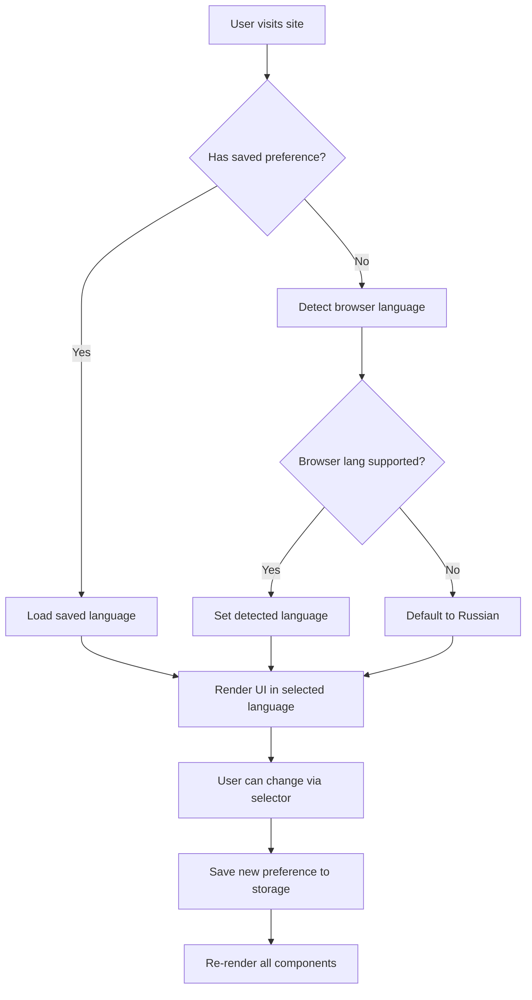

# Multilingual Support Design - English Language Integration

## Overview

This design outlines the implementation of multilingual functionality for the 4EX cryptocurrency exchange platform, with initial support for Russian (current) and English languages. The solution provides a scalable, maintainable architecture that enables seamless language switching across the entire application.

## Strategic Goals

**Primary Objectives:**
- Enable users to switch between Russian and English languages in real-time
- Maintain language preference across sessions using local storage persistence
- Ensure all user-facing text content supports multiple languages
- Provide admin-configurable translations for dynamic content
- Establish a foundation for adding additional languages in the future

**Success Criteria:**
- Complete translation coverage for all static UI elements
- Zero hardcoded text strings in components after implementation
- Language preference persists across browser sessions
- Admin panel content can be managed in multiple languages
- No performance degradation during language switching

## System Architecture

### Language Management Store

A centralized Zustand store manages language state and provides translation utilities.

**Store Responsibilities:**
- Track current active language (ru or en)
- Persist language selection to localStorage
- Provide translation lookup functions
- Handle language switching logic
- Support nested translation keys for organization

**State Structure:**

| Property | Type | Purpose |
|----------|------|---------|
| locale | 'ru' \| 'en' | Current active language code |
| setLocale | Function | Method to change active language |
| t | Function | Translation retrieval function with fallback support |

**Persistence Strategy:**
Store configuration is persisted to localStorage under key 'language-storage', ensuring user language preference is maintained across sessions and page reloads.

### Translation Dictionary Architecture

**Organization Pattern:**
Translations are organized into logical modules corresponding to application features, enabling maintainability and easy extension.

**Module Structure:**

```
translations/
├── common          - Shared UI elements (buttons, labels, messages)
├── navigation      - Header, footer, menu items
├── home            - Homepage sections and content
├── exchange        - Exchange calculator and workflow
├── auth            - Login, registration, password recovery
├── user            - User dashboard and settings
├── admin           - Admin panel interface
├── forms           - Form labels, placeholders, validation messages
├── errors          - Error messages and notifications
└── info            - FAQ, About, Rules, Contact pages
```

**Translation Entry Format:**

Each module contains nested objects with translation keys mapped to language-specific values:

| Language Code | Purpose | Example Key Path |
|---------------|---------|------------------|
| ru | Russian translations | common.buttons.submit |
| en | English translations | common.buttons.submit |

**Key Naming Convention:**
- Use camelCase for multi-word keys
- Organize hierarchically by feature and component
- Keep keys descriptive but concise
- Avoid deep nesting (max 3 levels recommended)

### Language Selector Component

**Visual Presentation:**
A dropdown selector or toggle button displayed in the application header, positioned alongside theme toggle and user authentication controls.

**Component Behavior:**

| Interaction | Result |
|-------------|--------|
| Click language option | Immediately switch UI language |
| Current language display | Show active language flag/code |
| Available languages list | Display ru (Русский) and en (English) |

**Accessibility Considerations:**
- Provide ARIA labels for screen readers
- Use language names in their native script (Русский, English)
- Ensure keyboard navigation support
- Maintain focus management after selection

### Translation Hook Pattern

**Hook Purpose:**
Provide components with translation function and current locale information through a custom React hook.

**Hook Interface:**

| Return Value | Type | Description |
|--------------|------|-------------|
| t | Function | Translation lookup function |
| locale | string | Current active language code |
| setLocale | Function | Language switching function |

**Usage Pattern:**
Components import the hook, destructure translation function, and use it to retrieve localized strings by key path.

## Content Translation Strategy

### Static UI Content

**Scope:**
All hardcoded user-visible text throughout the application requires translation keys.

**Component Categories:**

**Navigation Elements:**
- Header menu items (Home, Exchange, Tracking, About, FAQ)
- Footer navigation links
- Breadcrumb trails
- Tab labels

**Form Elements:**
- Input field labels and placeholders
- Button text (Submit, Cancel, Next, Previous)
- Checkbox and radio labels
- Select dropdown options
- Validation error messages

**Informational Text:**
- Page titles and headings
- Descriptive paragraphs
- Help tooltips
- Status messages
- Empty state messages

**Action Feedback:**
- Success notifications (toast messages)
- Error alerts
- Warning dialogs
- Confirmation prompts

### Dynamic Content Localization

**Admin-Managed Content:**
Content managed through the admin panel requires multi-language field storage.

**Affected Content Types:**

| Content Type | Fields Requiring Translation |
|--------------|------------------------------|
| Site Settings | Hero title, hero subtitle, feature titles, feature descriptions, CTA text |
| Announcements | Announcement message text |
| Reviews | Reviewer testimonials (optional translation) |
| FAQ Items | Questions and answers |
| Promotional Content | Promo descriptions, terms and conditions |

**Data Model Enhancement:**

Transform single-language fields into language-mapped objects:

**Before:**
Single string value for content

**After:**
Object with language keys mapping to translated values:
- ru: Russian version
- en: English version

**Fallback Strategy:**
If translation missing for active language, display Russian version as default, then show translation key if Russian also missing.

### Currency and Financial Data

**Non-Translated Elements:**
- Currency codes (BTC, ETH, USDT remain constant)
- Numeric values and amounts
- Wallet addresses
- Transaction IDs
- Exchange rates (numeric)

**Translated Elements:**
- Currency full names may have localized variants
- Network names (TRC20, ERC20 may include descriptive text)
- Payment method descriptions
- Fee descriptions and breakdowns

## User Experience Flow

### Language Selection Process

**User Journey:**



### Language Switching Behavior

**Immediate Effects:**
- All visible text updates instantly without page reload
- Form inputs maintain their entered values
- Current navigation position preserved
- Scroll position retained
- No data loss in multi-step forms

**State Preservation:**
- Exchange calculator values remain unchanged
- User authentication status unaffected
- Shopping cart or draft orders retained
- Admin panel filters and selections maintained

## Administrative Interface

### Language Management Panel

**Admin Capabilities:**

**Translation Editor:**
- View all translation keys organized by module
- Edit Russian and English values side-by-side
- Add new translation keys dynamically
- Search and filter translation entries
- Export/import translation files

**Content Translation Interface:**
- Edit multi-language site settings
- Create announcements in both languages
- Manage FAQ entries with language variants
- Preview content in each language

**Translation Status Dashboard:**
- Display completion percentage per language
- Highlight missing translations
- Show recently modified entries
- Track translation coverage by module

### Admin Panel Language Selection

**Scope:**
Admin panel interface is fully translated, allowing administrators to work in their preferred language.

**Settings Management:**
Admin can configure default language for new users and enable/disable specific languages site-wide.

## Technical Considerations

### Performance Optimization

**Translation Loading Strategy:**

**Approach 1 - Bundle All (Recommended for initial implementation):**
- Include all translations in main JavaScript bundle
- Immediate availability on application load
- No additional network requests
- Suitable given small translation file size

**Approach 2 - Lazy Loading (Future optimization):**
- Load translations asynchronously per language
- Reduce initial bundle size
- Implement when translation files become large
- Use dynamic imports with loading states

### Browser Language Detection

**Detection Logic:**

Priority order for determining initial language:
1. Saved user preference from localStorage
2. Browser language setting (navigator.language)
3. System default language (Russian)

**Matching Strategy:**
- Exact match: navigator.language = 'en' → English
- Partial match: navigator.language = 'en-US' → English
- No match: Use Russian as fallback

### SEO Considerations

**URL Strategy:**

**Option 1 - No URL modification (Recommended for SPA):**
- Language stored only in state and localStorage
- Same URLs across all languages
- Simpler implementation

**Option 2 - Language prefix routes:**
- Structure: /en/exchange, /ru/exchange
- Better for SEO and sharing
- Requires routing layer modification

**Meta Tags:**
- Update document language attribute on switch
- Set appropriate lang attribute on HTML element
- Update meta description if content-dependent

### Right-to-Left (RTL) Preparation

**Future Consideration:**
While current implementation focuses on Russian and English (both LTR languages), the architecture should accommodate RTL languages (Arabic, Hebrew) in future.

**Preparation Strategy:**
- Avoid hardcoded directional CSS (use logical properties)
- Structure layout components for flexible text direction
- Plan for mirrored UI elements in RTL mode

## Data Migration Strategy

### Existing Content Conversion

**Site Settings Migration:**

Transform existing single-language settings into multi-language structure:

**Process:**
1. Read current Russian values from settings store
2. Create new multi-language structure with ru and en keys
3. Set ru values from existing data
4. Add English translations (initial set from translation file)
5. Update store schema to support new structure
6. Save migrated data to localStorage

**Announcement Migration:**

Convert existing announcement messages:
1. Preserve existing Russian messages under 'ru' key
2. Add corresponding English translations
3. Update announcement display logic to use translation lookup

**Review and Testimonial Handling:**

**Option 1 - Display in original language:**
User reviews remain in their original submitted language

**Option 2 - Admin translation:**
Admin can optionally provide translations for featured reviews

### Default Translation Provision

**Initial English Translations:**
Complete English translation set must be provided for all existing UI elements, prepared during implementation phase.

**Quality Assurance:**
- Professional translation recommended for customer-facing content
- Technical accuracy for cryptocurrency and financial terms
- Consistent terminology across all modules
- Native speaker review before deployment

## Validation and Testing

### Translation Completeness Verification

**Automated Checks:**
- Verify all translation keys exist in both languages
- Identify missing translations
- Detect unused translation keys
- Compare translation structures for parity

**Visual Regression Testing:**
- Capture screenshots in both languages
- Verify layout integrity with longer/shorter text
- Test responsive breakpoints in each language
- Validate text overflow and truncation handling

### User Acceptance Testing Scenarios

**Core Workflows:**

| Test Scenario | Validation Points |
|---------------|-------------------|
| First-time visitor | Language detection works correctly |
| Language switching | All visible text updates immediately |
| Form submission | Validation messages appear in active language |
| Multi-step exchange | Language change preserves progress |
| Admin content editing | Multi-language fields save correctly |
| Session persistence | Language preference retained after browser close |

### Edge Cases

**Text Length Variations:**
- Russian text typically longer than English
- Verify button labels don't break layout
- Test navigation menu with longer translations
- Validate modal dialog text fitting

**Missing Translations:**
- Fallback to Russian when English missing
- Display translation key if both missing (development mode)
- Log missing keys for developer awareness

**Special Characters:**
- Test currency symbols in both languages
- Verify date/time formatting per locale
- Validate number formatting (comma vs period)

## Accessibility Requirements

**Screen Reader Support:**
- Announce language changes to screen readers
- Provide lang attribute updates on content changes
- Ensure ARIA labels are translated

**Keyboard Navigation:**
- Language selector fully keyboard accessible
- Tab order logical in both languages
- Focus indicators visible and consistent

**Visual Accessibility:**
- Sufficient color contrast maintained in both languages
- Text size requirements met regardless of content length
- RTL considerations for future expansion

## Localization Best Practices

**String Formatting:**
- Avoid concatenation that assumes word order
- Use template variables for dynamic content insertion
- Support plural forms where applicable
- Handle gender-specific translations if needed

**Date and Time:**
- Use locale-aware date formatting
- Display times in user's timezone
- Translate day/month names appropriately
- Support both 12-hour and 24-hour formats per locale

**Number Formatting:**
- Respect locale-specific decimal separators
- Use appropriate thousand separators
- Format currency amounts per locale conventions
- Display percentages consistently

**Cultural Adaptation:**
- Use appropriate greetings and tone
- Adapt examples and references to target audience
- Consider cultural color associations
- Localize images/icons where culturally specific

## Rollout Strategy

### Phase 1: Foundation
- Create language store and hook
- Implement translation dictionary structure
- Add language selector component
- Update core navigation components

### Phase 2: User Interface
- Translate all static UI components
- Update form labels and validation messages
- Implement notification message translations
- Convert informational pages (FAQ, About, Rules)

### Phase 3: Dynamic Content
- Migrate site settings to multi-language structure
- Update admin panel for content translation
- Convert announcements and promotions
- Implement fallback mechanisms

### Phase 4: Refinement
- Conduct comprehensive testing
- Address translation gaps
- Optimize performance
- Gather user feedback and iterate

## Monitoring and Maintenance

**Metrics to Track:**
- Language selection distribution (% users per language)
- Language switching frequency
- Missing translation error occurrences
- User engagement by language
- Admin translation update frequency

**Ongoing Maintenance:**
- Regular review of translation accuracy
- Update translations when features added
- Monitor user feedback about translations
- Keep terminology consistent with industry standards
- Plan for additional language expansion based on user demand

## Risk Assessment

| Risk | Impact | Mitigation |
|------|--------|------------|
| Incomplete translations at launch | High | Pre-launch translation audit, fallback system |
| Text overflow breaking layouts | Medium | Responsive design testing, truncation strategies |
| Performance degradation | Low | Bundle size monitoring, lazy loading if needed |
| Missing translation keys | Medium | Automated validation, development mode warnings |
| Cultural misunderstandings | Medium | Native speaker review, user feedback channels |
| Maintenance complexity | Low | Clear documentation, organized structure |

## Success Metrics

**Quantitative Indicators:**
- 100% translation coverage for core user flows
- Language switch response time under 100ms
- Zero layout breaks due to text length variations
- 95%+ user satisfaction with translation quality

**Qualitative Indicators:**
- Positive user feedback on translation accuracy
- Increased international user engagement
- Reduced support requests about language issues
- Successful admin adoption of multi-language content management

## Future Enhancements

**Additional Languages:**
Priority candidates based on user demand:
- Ukrainian
- Spanish
- Chinese
- German

**Advanced Localization:**
- Region-specific content variations
- Currency preference based on language
- Localized support resources
- Language-specific promotional campaigns

**Automated Translation:**
- Integration with translation management platforms
- Machine translation for admin content (with review)
- Community translation contribution system
- Real-time translation quality scoring