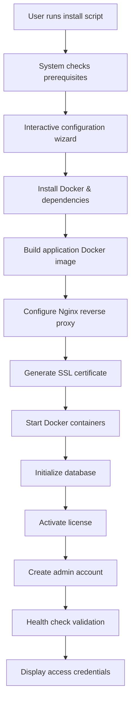
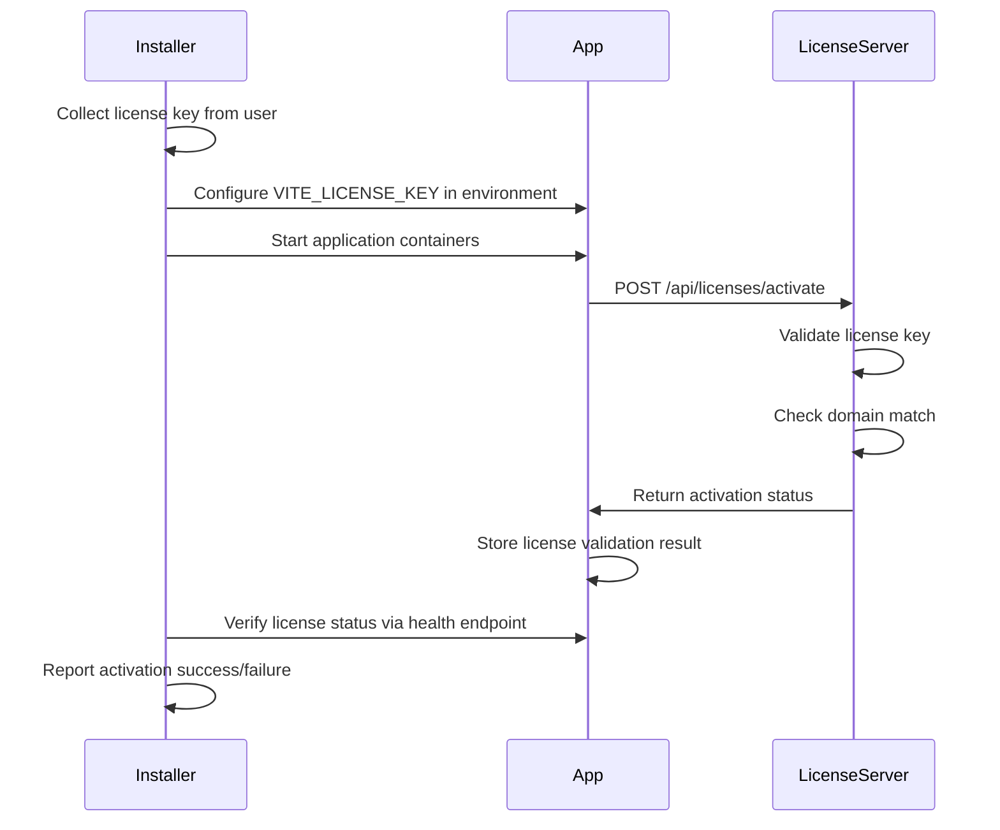

# Automated Web Application Setup System

## Overview

This design defines an automated one-click installation system for deploying the 4EX Currency Exchange Platform on Ubuntu 24.04 VPS servers using Docker containerization. The system will guide customers through a streamlined setup process that handles all technical complexities including dependency installation, domain configuration, SSL certificate generation, database setup, license activation, and administrator account creation.

## Goals and Objectives

### Primary Goals
- Provide a single-command installation experience for non-technical users
- Automate all server configuration and dependency management
- Ensure secure deployment with SSL certificates and proper security settings
- Enable zero-downtime production-ready deployment within 10-15 minutes
- Support both development and production environments

### Success Criteria
- Installation completes successfully on fresh Ubuntu 24.04 VPS with single command
- SSL certificate is automatically generated and configured
- Application is accessible via HTTPS on configured domain
- License validation works correctly post-installation
- Administrator can log in and access admin panel immediately after installation
- All services start automatically on server reboot

## System Architecture

### Component Overview

The installation system consists of the following key components:

| Component | Purpose | Technology |
|-----------|---------|------------|
| Master Installer Script | Entry point orchestrating entire installation | Bash script |
| Docker Compose Configuration | Defines multi-container application stack | Docker Compose YAML |
| Nginx Reverse Proxy | Handles HTTPS termination and routing | Nginx in Docker |
| Web Application Container | Main React application serving static files | Nginx Alpine in Docker |
| Configuration Manager | Interactive prompts and environment setup | Bash with validation |
| SSL Certificate Manager | Automated Let's Encrypt certificate generation | Certbot |
| Health Check System | Validates successful deployment | Bash with curl |

### Deployment Flow

The installation follows this high-level sequence:



## Installation Package Structure

All installation files will be organized in the INSTALL directory:

```
INSTALL/
├── install.sh                    # Main installation script
├── config/
│   ├── docker-compose.yml        # Docker composition definition
│   ├── nginx.conf.template       # Nginx configuration template
│   ├── .env.template             # Environment variables template
│   └── Dockerfile                # Application container definition
├── scripts/
│   ├── check-prerequisites.sh    # System requirements validation
│   ├── configure.sh              # Interactive configuration wizard
│   ├── setup-docker.sh           # Docker installation
│   ├── setup-ssl.sh              # SSL certificate generation
│   ├── setup-database.sh         # Database initialization
│   ├── setup-admin.sh            # Admin account creation
│   └── health-check.sh           # Post-installation validation
├── utils/
│   ├── validators.sh             # Input validation functions
│   ├── helpers.sh                # Common utility functions
│   └── messages.sh               # User-facing messages and formatting
└── README.md                     # Installation instructions
```

## Configuration Wizard

### User Input Collection

The configuration wizard will collect the following information interactively:

| Parameter | Description | Validation | Example |
|-----------|-------------|------------|---------|
| Domain Name | Primary domain for the application | Valid FQDN, DNS must point to server | exchange.example.com |
| Administrator Email | Email for SSL and admin account | Valid email format | admin@example.com |
| Administrator Password | Initial admin password | Minimum 12 characters, complexity check | Strong!Pass123 |
| License Key | Product license key | Format: LIC-XXXX-XXXX-XXXX-XXXX | LIC-A1B2-C3D4-E5F6-G7H8 |
| Database Password | PostgreSQL password | Minimum 16 characters, auto-generated option | Auto-generated default |
| Application Port | HTTP port for application | 1024-65535, default 80 | 80 |
| SSL Port | HTTPS port | 1024-65535, default 443 | 443 |

### Configuration Validation Process

Before proceeding with installation, the system validates:

1. **System Requirements**
   - Ubuntu 24.04 operating system
   - Minimum 2GB RAM available
   - Minimum 10GB free disk space
   - Root or sudo privileges
   - Internet connectivity

2. **Domain Configuration**
   - DNS A record points to server IP
   - Port 80 and 443 are not in use
   - Domain is reachable via HTTP

3. **Input Validation**
   - Email format correctness
   - Password strength requirements
   - License key format validation
   - Port availability

4. **Network Prerequisites**
   - Firewall allows HTTP/HTTPS traffic
   - No conflicting services on required ports

## Docker Configuration

### Application Container

The web application runs in a lightweight Nginx-based container:

**Container Specifications:**
- Base Image: nginx:alpine
- Purpose: Serve static React application build
- Exposed Port: 3000 (internal)
- Volume Mounts: Application files, Nginx configuration
- Health Check: HTTP GET on root path every 30 seconds
- Restart Policy: Always restart unless stopped
- Resource Limits: 512MB memory, 0.5 CPU cores

**Build Process:**
1. Install Node.js build dependencies
2. Copy application source files
3. Install npm dependencies
4. Run production build process
5. Copy build artifacts to Nginx serve directory
6. Remove build dependencies to minimize image size

### Nginx Reverse Proxy Container

**Container Specifications:**
- Base Image: nginx:alpine
- Purpose: HTTPS termination, request routing, static file caching
- Exposed Ports: 80 (HTTP), 443 (HTTPS)
- Volume Mounts: SSL certificates, Nginx configuration, static assets
- Configuration Features:
  - Automatic HTTP to HTTPS redirect
  - SSL certificate configuration
  - Proxy headers forwarding
  - Gzip compression enabled
  - Security headers injection
  - Rate limiting protection
  - Static file caching (30 days for assets)

### Docker Compose Orchestration

**Network Configuration:**
- Custom bridge network for inter-container communication
- Only reverse proxy exposes ports to host
- Internal DNS resolution between containers

**Volume Management:**
- Named volume for SSL certificates persistence
- Named volume for application logs
- Bind mount for configuration files

**Environment Variables:**
- All sensitive data passed via environment files
- No hardcoded credentials in containers
- Runtime configuration injection

## SSL Certificate Management

### Automatic Certificate Generation

The system uses Certbot with DNS challenge or HTTP challenge:

**Certificate Acquisition Process:**
1. Verify domain DNS points to server
2. Stop any service on port 80 temporarily
3. Run Certbot in standalone mode for initial certificate
4. Configure Nginx with obtained certificates
5. Set up automatic renewal cron job

**Certificate Configuration:**
- Certificate Authority: Let's Encrypt
- Certificate Type: RSA 2048-bit or ECDSA P-256
- Validity Period: 90 days
- Auto-renewal: Triggered 30 days before expiration
- Renewal Method: HTTP-01 challenge via Nginx

**Security Settings:**
- TLS 1.2 and 1.3 only
- Strong cipher suite configuration
- HSTS header enabled (max-age: 31536000)
- OCSP stapling enabled
- SSL session caching configured

### Renewal Automation

**Cron Job Configuration:**
- Schedule: Daily at 2:00 AM server time
- Command: Certbot renew with Nginx reload hook
- Logging: Renewal attempts logged to dedicated file
- Notification: Email alert on renewal failures

## Database Setup

### Database Technology Selection

While the current application primarily uses LocalStorage and in-memory state management, the installation prepares for future database integration:

**Database Service:** PostgreSQL 15 in Docker container

**Container Specifications:**
- Base Image: postgres:15-alpine
- Purpose: Persistent data storage for future features
- Exposed Port: 5432 (internal only, not exposed to host)
- Volume Mounts: Database data directory
- Environment Variables: Database credentials, initial database name
- Health Check: PostgreSQL ready check every 10 seconds
- Backup Strategy: Daily automated backups to volume

**Initial Database Configuration:**
- Database Name: exchange_db
- Default Schema: public
- Character Encoding: UTF-8
- Locale: en_US.UTF-8
- Connection Pool: Configured for moderate load

**Security Measures:**
- Database accessible only within Docker network
- Strong auto-generated password
- No default postgres user usage
- Connection logging disabled in production

### Database Initialization

**Initialization Process:**
1. Container starts with empty data directory
2. PostgreSQL initializes database cluster
3. Create application database
4. Create application user with limited privileges
5. Set secure password from environment
6. Apply initial schema (if schema files provided)
7. Create admin user record in users table

**Health Validation:**
- Verify PostgreSQL accepts connections
- Validate database exists
- Confirm application user can authenticate
- Test basic query execution

## License Activation

### License Validation Flow

The installation system integrates with the existing license server:



**License Configuration Parameters:**

| Parameter | Source | Purpose |
|-----------|--------|---------|
| VITE_LICENSE_KEY | User input during installation | License key for product |
| VITE_LICENSE_SERVER_URL | Hardcoded default | License validation endpoint |
| VITE_LICENSE_ENABLE_VALIDATION | Set to true | Enable license checks |
| VITE_LICENSE_CHECK_INTERVAL | Default 24 hours | Revalidation frequency |
| VITE_LICENSE_GRACE_PERIOD | Default 7 days | Offline grace period |
| VITE_APP_URL | User's domain | Domain binding for license |

**Activation Process:**
1. Installer writes license key to environment file
2. Application container starts with license configuration
3. On first startup, application contacts license server
4. License server validates key and domain match
5. Activation result stored in application state
6. Installer verifies successful activation via API health check
7. If activation fails, installer displays error and offers retry

**Error Handling:**
- Invalid license key: Prompt user to re-enter correct key
- Domain mismatch: Display registered domain vs. current domain
- License server unreachable: Explain grace period, proceed with warning
- Expired license: Display expiration date, contact support information
- License limit reached: Show current activations, deactivation instructions

## Administrator Account Creation

### Account Setup Process

The installation creates an initial administrator account:

**Account Details Collection:**
- Username: admin (default) or custom
- Email: Collected during configuration wizard
- Password: Strong password from user input
- Role: Administrator with full privileges
- 2FA Status: Disabled initially, recommended to enable post-install

**Account Creation Method:**

Since the application currently uses LocalStorage for user management, the installer will:

1. Generate secure password hash using bcrypt
2. Create initial admin user object in predefined format
3. Store admin credentials in secure configuration file
4. Configure admin user in application state initialization
5. Display credentials to installer operator securely

**For Future Database Integration:**

When database is integrated, the account creation will:
1. Generate bcrypt password hash (cost factor: 12)
2. Create admin user record in users table
3. Set role to 'admin' with all permissions
4. Mark email as verified
5. Set account status as active
6. Log account creation event

**Security Measures:**
- Password strength validation (min 12 chars, uppercase, lowercase, number, symbol)
- Password never logged or stored in plaintext
- Initial password must be changed on first login (future feature)
- Account creation logged to audit trail
- Credentials displayed once during installation, not persisted in logs

## Installation Process Execution

### Phase 1: Prerequisites Check

**System Validation:**
- Verify Ubuntu 24.04 operating system
- Check available RAM (minimum 2GB)
- Check free disk space (minimum 10GB)
- Verify root or sudo access
- Test internet connectivity
- Check DNS resolution

**Dependency Detection:**
- Detect if Docker is installed
- Detect if Docker Compose is installed
- Detect if required ports are available
- Identify conflicting services

### Phase 2: Interactive Configuration

**User Interaction Flow:**
1. Display welcome message and installation overview
2. Request domain name with validation
3. Request administrator email with validation
4. Request administrator password with strength check
5. Request license key with format validation
6. Offer auto-generated database password or custom input
7. Confirm port selections (default 80/443)
8. Display configuration summary for user confirmation
9. Ask for final confirmation before proceeding

**Configuration Storage:**
- Write validated inputs to temporary configuration file
- Generate environment file from template
- Create Docker Compose file from template with substitutions
- Generate Nginx configuration from template

### Phase 3: System Preparation

**Docker Installation:**
- Add Docker's official GPG key
- Set up Docker repository for Ubuntu 24.04
- Install Docker Engine and Docker Compose plugin
- Start and enable Docker service
- Add current user to docker group (if not root)
- Verify Docker installation with test container

**Firewall Configuration:**
- Enable UFW if not enabled
- Allow SSH (port 22)
- Allow HTTP (port 80)
- Allow HTTPS (port 443)
- Deny all other incoming by default
- Enable firewall with rules

**System Optimization:**
- Set appropriate file descriptor limits
- Configure kernel parameters for networking
- Set up log rotation for application logs
- Configure system timezone

### Phase 4: Application Deployment

**Build Process:**
1. Copy application files to deployment directory
2. Generate production-optimized Dockerfile
3. Build application Docker image with build arguments
4. Tag image with version and latest
5. Verify successful build

**Container Launch:**
1. Create Docker network for application
2. Start PostgreSQL container and wait for readiness
3. Initialize database with credentials
4. Start application container with environment variables
5. Start Nginx reverse proxy container
6. Verify all containers are running and healthy

### Phase 5: SSL Certificate Setup

**Certificate Acquisition:**
1. Ensure domain resolves to server IP
2. Verify ports 80 and 443 are accessible
3. Run Certbot in standalone mode or webroot mode
4. Provide administrator email for renewal notifications
5. Agree to Let's Encrypt Terms of Service
6. Obtain certificate and private key
7. Move certificates to Docker volume
8. Configure Nginx with SSL certificate paths
9. Reload Nginx configuration

**HTTP to HTTPS Redirect:**
- Configure automatic redirect from HTTP to HTTPS
- Preserve request URI and query parameters
- Set 301 permanent redirect status

### Phase 6: License Activation

**Activation Execution:**
1. Verify license key is configured in environment
2. Ensure VITE_APP_URL matches configured domain
3. Wait for application container to be healthy
4. Trigger license activation via internal API call
5. Monitor activation response
6. Validate successful activation
7. Display license status to user

**Validation Checks:**
- License key accepted by server
- Domain successfully bound to license
- License type and expiration date retrieved
- License features enabled correctly

### Phase 7: Post-Installation Validation

**Health Checks:**
1. Verify all Docker containers are running
2. Check application responds on HTTP port
3. Check HTTPS endpoint with valid certificate
4. Verify SSL certificate validity
5. Test database connectivity
6. Confirm license validation status
7. Validate admin account can authenticate
8. Test application routing and asset loading

**Service Configuration:**
- Configure containers to restart automatically
- Set up log rotation for container logs
- Create backup script for database
- Schedule automated SSL renewal cron job

**Completion Report:**
- Display application URL (HTTPS)
- Show administrator credentials
- Display license status and expiration
- Provide next steps and recommendations
- Show helpful management commands
- Log all installation details to file

## Error Handling and Recovery

### Error Categories and Responses

**Prerequisites Failures:**
- Insufficient resources: Display requirements, exit installation
- Wrong OS version: Warn user, offer to continue with risks
- Missing permissions: Provide sudo instructions, exit
- DNS not configured: Display DNS setup guide, allow retry or skip

**Configuration Errors:**
- Invalid domain format: Re-prompt with example
- Weak password: Display requirements, re-prompt
- Invalid license key: Allow retry or contact support option
- Port conflicts: Suggest alternative ports or identify conflicting service

**Installation Failures:**
- Docker installation fails: Display error log, offer manual installation guide
- Build fails: Show build logs, check disk space and connectivity
- Container won't start: Display container logs, check configuration
- SSL generation fails: Verify domain DNS, check rate limits, offer manual setup

**Activation Failures:**
- License server unreachable: Note grace period, proceed with warning
- License invalid: Display error message, offer re-entry
- Domain mismatch: Show expected vs actual domain, offer contact support

### Rollback Mechanism

**Automatic Rollback Triggers:**
- Critical failure during container deployment
- Database initialization failure
- License activation completely fails (optional based on grace period)

**Rollback Process:**
1. Stop all running containers
2. Remove created containers
3. Delete Docker volumes (with user confirmation)
4. Remove generated configuration files
5. Restore firewall rules to previous state
6. Remove Docker network
7. Display rollback completion message
8. Preserve logs for troubleshooting

**Manual Recovery Options:**
- Provide cleanup script to remove all installation artifacts
- Offer partial rollback (keep database, remove containers)
- Create installation state checkpoint before each phase

### Logging and Debugging

**Log Files Structure:**
- Master installation log: Complete installation transcript
- Docker build log: Build process output
- Container logs: Per-container runtime logs
- Error log: All errors and warnings
- License activation log: Activation attempts and responses

**Debugging Capabilities:**
- Verbose mode flag for detailed output
- Dry-run mode to test configuration without changes
- Step-by-step mode with pause between phases
- Log preservation even after successful installation

## Security Considerations

### Installation Security

**Secure Credential Handling:**
- Passwords never logged in plaintext
- Temporary configuration files have restricted permissions (600)
- Environment files readable only by owner
- Secure deletion of sensitive temporary files after installation

**Network Security:**
- Firewall configured before services start
- Only required ports exposed
- Internal Docker network for service communication
- No database port exposed to host

**SSL/TLS Security:**
- Strong cipher suites configured
- TLS 1.2 minimum version
- HSTS enabled with long max-age
- Secure SSL session parameters

### Runtime Security

**Container Security:**
- Containers run as non-root users where possible
- Read-only root filesystems where applicable
- Capability dropping for unnecessary privileges
- Resource limits prevent DoS

**Application Security:**
- Environment-based configuration (no hardcoded secrets)
- License validation enabled in production
- Admin password strength enforcement
- Session management security

**Maintenance Security:**
- Automated security updates for base images
- Regular SSL certificate renewal
- Database backup encryption
- Log file access restrictions

## Post-Installation Management

### Service Management Commands

The installer will provide documentation for common operations:

**Container Management:**
- Start all services
- Stop all services
- Restart specific service
- View service status
- View service logs
- Update container images

**Database Operations:**
- Create database backup
- Restore from backup
- Access database console
- View database logs

**SSL Certificate Management:**
- Force certificate renewal
- Check certificate expiration
- View certificate details

**Application Updates:**
- Pull latest application version
- Rebuild containers with new version
- Apply configuration changes
- Roll back to previous version

### Monitoring and Maintenance

**Health Monitoring:**
- Container health status check script
- Application endpoint monitoring
- SSL certificate expiration alerts
- Disk space monitoring
- Database connection monitoring

**Automated Maintenance:**
- Daily database backups
- Weekly log rotation
- Monthly Docker cleanup (remove unused images)
- SSL certificate renewal (30 days before expiry)

**Backup Strategy:**
- Daily automated database dumps
- Weekly full system backup recommendation
- Environment configuration backup
- SSL certificate backup

## Installation Requirements Summary

### Server Requirements

**Minimum Specifications:**
- Operating System: Ubuntu 24.04 LTS (fresh installation recommended)
- CPU: 2 cores
- RAM: 2GB minimum, 4GB recommended
- Disk Space: 10GB minimum, 20GB recommended
- Network: Public IP address, stable internet connection

**Required Access:**
- Root user or user with sudo privileges
- SSH access to server
- Port 22 (SSH), 80 (HTTP), 443 (HTTPS) accessible

### Domain Requirements

**DNS Configuration:**
- A record pointing to server public IP
- DNS propagation completed (can be checked during installation)
- Domain not blocked by hosting provider

### License Requirements

**Valid License Key:**
- Format: LIC-XXXX-XXXX-XXXX-XXXX
- License type: Any valid type (Trial, Standard, Professional, Enterprise, Lifetime)
- Not expired
- Activation slots available
- Domain eligible for activation

### User Prerequisites

**Information Needed:**
- Domain name for application
- Administrator email address
- Strong administrator password
- Valid license key
- Database password (optional, can be auto-generated)

**Technical Knowledge:**
- Basic SSH usage
- Basic Linux command line navigation
- Understanding of domain DNS configuration
- Email access for SSL certificate notifications

## Installation Modes

### Standard Interactive Mode

**Characteristics:**
- Step-by-step prompts for all configuration
- Input validation with helpful error messages
- Configuration summary before proceeding
- Progress indicators for each phase
- Detailed success/error messages

**Use Case:** Recommended for most users, especially first-time installers

### Unattended Mode

**Characteristics:**
- All configuration provided via command-line arguments or config file
- No interactive prompts
- Non-blocking execution
- Suitable for automated deployments
- Exit codes indicate success/failure

**Configuration File Format:**
```
DOMAIN=exchange.example.com
ADMIN_EMAIL=admin@example.com
ADMIN_PASSWORD=SecurePassword123!
LICENSE_KEY=LIC-XXXX-XXXX-XXXX-XXXX
DB_PASSWORD=auto
APP_PORT=80
SSL_PORT=443
```

**Use Case:** CI/CD pipelines, mass deployments, scripted installations

### Development Mode

**Characteristics:**
- Skip SSL certificate generation (use self-signed)
- License validation can be disabled
- Debug logging enabled
- Additional development tools included
- Test data pre-populated

**Use Case:** Testing installation process, development environments

## Documentation and User Support

### Installation Documentation

**README.md Contents:**
- Quick start guide (5-minute installation)
- Detailed step-by-step instructions
- Prerequisites checklist
- Troubleshooting common issues
- FAQ section
- Contact support information

### Inline Help

**During Installation:**
- Contextual help for each configuration prompt
- Examples for input formats
- Links to relevant documentation
- Error message explanations with resolution steps

### Post-Installation Guide

**Topics Covered:**
- First login to admin panel
- Basic configuration walkthrough
- Setting up first currency exchange
- Enabling optional features
- Security hardening recommendations
- Performance optimization tips
- Backup and recovery procedures

## Testing and Validation Strategy

### Installation Testing

**Test Scenarios:**
1. Fresh Ubuntu 24.04 installation (clean state)
2. Ubuntu with Docker pre-installed
3. Server with existing web services (port conflicts)
4. Invalid domain configurations
5. License activation failures
6. Network connectivity issues
7. Insufficient system resources
8. User cancellation at various stages

**Validation Points:**
- All containers start successfully
- Application accessible via HTTPS
- SSL certificate valid and trusted
- Admin login works correctly
- License shows as active
- Database connectivity established
- All health checks pass

### Automated Testing

**Pre-Release Testing:**
- Automated test suite runs installation in isolated VMs
- Test success rate across different configurations
- Performance benchmarking of installation time
- Resource usage monitoring during installation

## Success Metrics

### Installation Success Indicators

**Technical Success:**
- Installation completes without errors
- All services running and healthy
- HTTPS accessible with valid certificate
- License activated successfully
- Admin can log in
- Time to complete: Under 15 minutes

**User Success:**
- User can complete installation without external help
- Clear understanding of next steps
- Confidence in system security
- Ability to perform basic operations post-install

## Exclusions and Scope Limitations

### Explicitly Excluded from Installation

The following components will NOT be included in the installation package:

1. **License Server**
   - Customers use centralized license server
   - No local license server deployment
   - License validation is remote

2. **Telegram Bot Server**
   - Bot integration optional
   - Separate installation if customer wants bot
   - Not part of core application deployment

3. **Email Server Configuration**
   - Customer responsible for email service configuration
   - Installation does not set up SMTP server
   - Email settings configured post-installation in admin panel

4. **Backup Server/External Storage**
   - Backups stored locally on server
   - External backup configuration is customer responsibility
   - Backup scripts provided, storage not managed

5. **Monitoring and Analytics Tools**
   - No pre-installed monitoring solution
   - Customer can add monitoring separately
   - Basic health checks included only

### Future Enhancement Opportunities

**Potential Additions:**
- Multi-server deployment support
- Load balancer configuration
- Redis cache installation
- CDN integration assistance
- Automated backup to cloud storage
- Monitoring dashboard installation
- Optional Telegram bot installation wizard

## Risk Assessment and Mitigation

### Technical Risks

| Risk | Probability | Impact | Mitigation |
|------|-------------|--------|------------|
| DNS not propagated | Medium | High | Pre-flight DNS check, skip SSL option, manual retry |
| Docker installation fails | Low | High | Fallback to manual Docker setup guide, comprehensive error logging |
| Port conflicts | Medium | Medium | Detect conflicts early, offer alternative ports, identify blocking service |
| Insufficient resources | Low | High | Prerequisites check before starting, clear error messages |
| License server unavailable | Low | Medium | Grace period support, offline mode explanation, retry mechanism |
| SSL rate limit hit | Low | Medium | Detect previous attempts, suggest waiting period, manual cert option |

### User Experience Risks

| Risk | Probability | Impact | Mitigation |
|------|-------------|--------|------------|
| User enters wrong information | High | Medium | Validation with clear examples, confirmation step, allow re-entry |
| User loses credentials | Medium | Medium | Save to secure file, option to display again, password reset procedure |
| User confused by prompts | Medium | Low | Clear language, contextual help, progress indicators |
| Installation takes too long | Low | Medium | Progress indicators, estimated time remaining, parallel operations |

### Security Risks

| Risk | Probability | Impact | Mitigation |
|------|-------------|--------|------------|
| Credentials exposed in logs | Low | High | Never log passwords, sanitize all logs, secure file permissions |
| Weak password accepted | Medium | Medium | Strong password validation, strength meter, examples |
| Firewall misconfiguration | Low | High | Automated firewall setup, validation checks, rollback on failure |
| SSL certificate errors | Medium | Medium | Detailed error messages, fallback options, manual setup guide |

## Maintenance and Update Strategy

### Installation Package Updates

**Version Management:**
- Installation package versioned separately from application
- Semantic versioning (MAJOR.MINOR.PATCH)
- Changelog maintained for each version
- Backward compatibility for configuration files

**Update Distribution:**
- Download latest version from official source
- Checksums provided for integrity verification
- Release notes highlight changes and fixes

### Application Updates

**Update Process:**
- Pull latest Docker image
- Stop current containers gracefully
- Start new containers with updated image
- Run database migrations if needed
- Verify successful update
- Rollback capability if update fails

**Zero-Downtime Updates (Future):**
- Blue-green deployment support
- Health check before switching traffic
- Automatic rollback on health check failure

## Localization Considerations

### Installation Language

**Current Implementation:**
- Installation script in English
- Error messages in English
- Documentation in English

**Future Enhancement:**
- Russian language support (matches application default)
- Language selection at installation start
- Localized error messages and help text

### Application Localization

**Post-Installation Configuration:**
- Default language set to Russian (VITE_DEFAULT_LANGUAGE=ru)
- Multi-language support already in application
- User can change language in admin panel

## Compliance and Legal

### License Agreement

**During Installation:**
- Display software license agreement
- Require explicit acceptance before proceeding
- Log acceptance timestamp and IP
- Store acceptance record

### Data Privacy

**Installation Data Collection:**
- No telemetry or analytics data collected during installation
- No personally identifiable information sent to external servers
- License activation sends only: license key, domain, IP address
- User informed of license server communication

### Terms of Service

**User Acknowledgment:**
- User confirms license purchase
- User agrees to license terms
- User confirms domain ownership
- User accepts responsibility for deployment security

## Appendix: Technical Specifications

### Environment Variables

Complete list of environment variables configured by installer:

| Variable | Purpose | Example Value | Source |
|----------|---------|---------------|--------|
| VITE_LICENSE_KEY | License activation | LIC-XXXX-XXXX-XXXX-XXXX | User input |
| VITE_LICENSE_SERVER_URL | License validation endpoint | https://licenses.4ex.com | Hardcoded |
| VITE_LICENSE_ENABLE_VALIDATION | Enable license checks | true | Set by installer |
| VITE_APP_URL | Application base URL | https://exchange.example.com | User domain |
| VITE_APP_ENV | Environment type | production | Set by installer |
| VITE_DEBUG | Debug mode | false | Set by installer |
| VITE_DEFAULT_THEME | UI theme | dark | Default |
| VITE_DEFAULT_LANGUAGE | UI language | ru | Default |
| VITE_ENABLE_2FA | Two-factor auth | true | Default |
| POSTGRES_DB | Database name | exchange_db | Generated |
| POSTGRES_USER | Database user | exchange_user | Generated |
| POSTGRES_PASSWORD | Database password | Auto-generated | Generated or user input |

### Port Mappings

| Container | Internal Port | External Port | Purpose |
|-----------|---------------|---------------|---------|
| Nginx Reverse Proxy | 80 | 80 | HTTP (redirect to HTTPS) |
| Nginx Reverse Proxy | 443 | 443 | HTTPS application access |
| Application | 3000 | - | Internal app server (not exposed) |
| PostgreSQL | 5432 | - | Database (internal only) |

### Volume Mappings

| Volume Name | Mount Point | Purpose | Backup Priority |
|-------------|-------------|---------|-----------------|
| ssl_certificates | /etc/letsencrypt | SSL certificates and keys | High |
| postgres_data | /var/lib/postgresql/data | Database files | Critical |
| app_logs | /var/log/app | Application logs | Medium |
| nginx_logs | /var/log/nginx | Nginx access and error logs | Low |

### Network Configuration

**Docker Network:**
- Name: exchange_network
- Driver: bridge
- Subnet: Auto-assigned by Docker
- Gateway: Auto-assigned by Docker
- DNS: Docker internal DNS

**Container Communication:**
- Application container communicates with PostgreSQL via internal network
- Nginx proxy forwards to application container via internal network
- Only Nginx exposes ports to host network- Nginx proxy forwards to application container via internal network
- Only Nginx exposes ports to host network