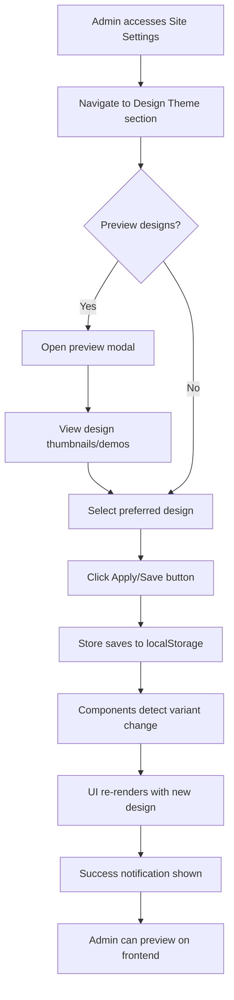
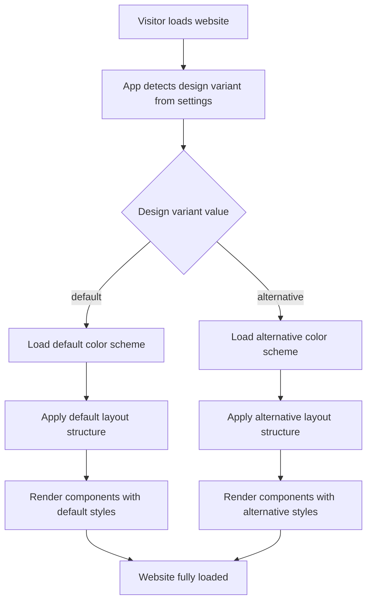

# Alternative Website Design System with Admin Control

## Overview

This design document outlines the implementation of an alternative website design theme featuring a completely different color palette and layout structure that can be dynamically switched from the admin panel. The system will allow administrators to toggle between the current design and the alternative design without code redeployment.

## Business Objectives

- Provide visual variety and brand flexibility
- Enable A/B testing capabilities for design effectiveness
- Allow seasonal or promotional design changes
- Enhance user experience through design personalization
- Maintain all existing functionality across both designs

## Design Variants

### Current Design (Default)
- Color scheme: Blue primary gradient with purple accents
- Layout: Centered content with traditional card-based structure
- Hero section: Centered text with gradient background
- Features: Grid layout with icon-top cards
- Visual style: Modern, clean, corporate

### Alternative Design (New)
- Color scheme: Emerald green primary with amber/gold accents
- Layout: Asymmetric layout with side-aligned elements
- Hero section: Split layout with image/illustration area
- Features: Staggered card layout with side icons
- Visual style: Dynamic, energetic, modern startup

## System Architecture

### Design Theme State Management

The system will introduce a new design theme store that manages the active design variant independently from the existing dark/light theme functionality.

**State Structure:**
- designVariant: Identifier for active design (default or alternative)
- Persistence: localStorage under key 'design-variant-storage'
- Default value: default design
- Synchronization: Real-time application across all components

### Color System Extension

**Alternative Design Color Palette:**
- Primary Colors: Emerald spectrum (emerald-50 through emerald-900)
- Accent Colors: Amber/Gold spectrum (amber-50 through amber-900)
- Neutral Colors: Slate spectrum for backgrounds and text
- Gradient: Emerald to teal linear gradient

**Color Token Structure:**
| Token Category | Default Design | Alternative Design |
|---------------|----------------|-------------------|
| Primary Base | Blue 500 (#3b82f6) | Emerald 500 (#10b981) |
| Primary Dark | Blue 700 (#1d4ed8) | Emerald 700 (#047857) |
| Accent | Purple 600 (#8b5cf6) | Amber 500 (#f59e0b) |
| Background Light | Gray 50 (#f8fafc) | Slate 50 (#f8fafc) |
| Background Dark | Dark 900 (#0f172a) | Slate 900 (#0f172a) |
| Gradient | Blue to Purple | Emerald to Teal |

### Layout Variant System

**Home Page Layout Variants:**

Default Layout Structure:
- Hero: Full-width centered with centered CTA
- Stats: 3-column centered grid below hero
- Features: 4-column equal-height grid
- Crypto Rates: 3-column centered cards
- Popular Directions: 3-column grid
- Testimonials: Carousel centered layout

Alternative Layout Structure:
- Hero: 60/40 split layout (text left, visual right)
- Stats: Inline horizontal scroll with larger cards
- Features: 2-column staggered layout with alternating alignment
- Crypto Rates: Vertical stacked cards with side-by-side comparison
- Popular Directions: Asymmetric grid (2 large + 4 small)
- Testimonials: Masonry grid layout

**Exchange Page Layout Variants:**

Default Layout:
- Calculator: Centered single column form
- Steps: Vertical stepper on left, content on right
- Status tracking: Timeline horizontal

Alternative Layout:
- Calculator: Side panel fixed position (sticky)
- Steps: Horizontal progress bar with accordion content
- Status tracking: Circular progress visualization

### Component Styling Strategy

**Variant Implementation Method:**

Each component will support design-aware styling through:
- Conditional className application based on active design variant
- Design-specific Tailwind utility classes
- Shared base styles for consistency
- Variant-specific spacing and sizing adjustments

**Component Variants Table:**

| Component | Default Style | Alternative Style |
|-----------|--------------|------------------|
| Button | Rounded, solid fill, icon right | Rounded-full, gradient, icon left |
| Card | White bg, subtle shadow, 8px radius | Colored tinted bg, strong shadow, 16px radius |
| Input | Border all sides, focus blue ring | Bottom border only, focus emerald ring |
| Header | Sticky top, white bg, shadow | Blurred backdrop, transparent, no shadow |
| Footer | Dark bg, 3-column grid | Gradient bg, 4-column grid with logo section |

### Admin Panel Integration

**Design Switcher Control Location:**
- Admin Site Settings page: New section added
- Position: Top section for high visibility
- Control type: Radio button group or toggle switch
- Real-time preview: Optional thumbnail preview of each design

**Admin Interface Elements:**

Section Title: "Design Theme Selection"

Control Elements:
- Radio option: Default Design (with thumbnail)
- Radio option: Alternative Design (with thumbnail)
- Description text: Brief explanation of each design
- Preview button: Opens modal with design preview
- Apply button: Saves selection and applies immediately

**Persistence and Application:**

Settings Storage:
- Store selected design variant in site settings store
- Persist to localStorage under 'site-settings-storage'
- Separate from theme (dark/light) selection
- Independent configuration per setting

Application Flow:
- Admin selects design variant in admin panel
- Setting saved to site settings store
- Store triggers update across application
- All components re-render with new variant styles
- No page reload required for change

## Layout Transformation Details

### Hero Section Transformation

**Default Hero Layout:**
- Container: max-width centered
- Text alignment: Center
- Title: 5xl font, centered, gradient text
- Subtitle: xl font, max-width 2xl, centered
- CTA button: Large size, centered, icon right
- Stats: Below CTA, 3-column grid, centered

**Alternative Hero Layout:**
- Container: Full-width grid with 2 columns (60/40 split)
- Text alignment: Left
- Title: 6xl font, left-aligned, solid color with underline accent
- Subtitle: lg font, left-aligned, max-width xl
- CTA button: Large size, left-aligned, gradient background, icon left
- Stats: Right column, vertical stack with large numbers
- Visual element: Right column, illustration or animated graphics placeholder

### Features Section Transformation

**Default Features Layout:**
- Grid: 4 columns on desktop, 2 on tablet, 1 on mobile
- Card style: Equal height, icon centered top
- Icon position: Top center, 40px size
- Text alignment: Center
- Spacing: Equal gaps, 24px

**Alternative Features Layout:**
- Grid: 2 columns on desktop, 1 on mobile
- Card style: Staggered heights, icon left side
- Icon position: Left side, 48px size, aligned with title
- Text alignment: Left
- Spacing: Alternating top margins for stagger effect
- Background: Alternating card background tints

### Exchange Calculator Transformation

**Default Calculator Layout:**
- Position: Static, centered in page flow
- Width: max-width 2xl, centered
- Form layout: Vertical stacked fields
- Currency selectors: Full-width dropdowns
- Amount input: Full-width with currency icon
- Submit button: Full-width at bottom

**Alternative Calculator Layout:**
- Position: Sticky sidebar on desktop, static on mobile
- Width: Fixed 400px sidebar on desktop, full on mobile
- Form layout: Compact vertical with grouped fields
- Currency selectors: Split layout with swap icon between
- Amount input: Inline with currency selector
- Submit button: Fixed at bottom of sidebar

## Responsive Behavior

**Design Variant Responsiveness:**

Both design variants must maintain responsive behavior with breakpoints:
- Mobile (< 768px): Single column layouts, stacked elements
- Tablet (768px - 1024px): 2-column layouts where applicable
- Desktop (> 1024px): Full multi-column layouts as designed

**Layout Priority by Breakpoint:**

Mobile Breakpoint:
- Alternative design reverts to simpler vertical layouts
- Staggered effects disabled on mobile
- Fixed sidebar becomes static full-width

Tablet Breakpoint:
- Asymmetric layouts adjust to 2-column grids
- Side-by-side elements maintained where possible
- Some alternative layout features preserved

Desktop Breakpoint:
- Full alternative layout features enabled
- Sticky elements activated
- Complex grid layouts applied

## Technical Implementation Considerations

### Tailwind Configuration Extension

New color scales must be added to Tailwind configuration:
- Emerald color scale (primary for alternative)
- Amber color scale (accent for alternative)
- Teal color scale (gradient component)
- Slate color scale (alternative neutrals)

New gradient definitions:
- gradient-alternative: Emerald to teal linear gradient
- gradient-accent: Amber to orange linear gradient

### Component Conditional Rendering

Components will use design variant detection pattern:

Pattern Structure:
- Import design variant from store
- Define className variables for default and alternative
- Apply conditional className based on variant
- Maintain shared base classes for consistency

### State Management Integration

**New Store: designVariantStore**

State Properties:
- variant: Current design variant identifier (default or alternative)
- setVariant: Function to update design variant
- Persistence through zustand/persist middleware

**Integration with Site Settings:**

The design variant selection will be stored within site settings store:
- New property: designVariant (string: 'default' or 'alternative')
- Accessed by all components needing design-aware rendering
- Updated through admin panel interface

### Performance Optimization

**Lazy Loading Strategy:**
- Alternative design assets loaded only when variant selected
- Component style variants inline (no separate CSS bundles)
- Thumbnail previews optimized for fast loading

**Caching Strategy:**
- Design variant preference cached in localStorage
- Immediate application on page load (no flash)
- CSS classes applied via Tailwind (no runtime CSS generation)

## Migration and Compatibility

### Existing Theme Compatibility

The design variant system must coexist with existing dark/light theme:
- Independent state management
- Both systems can be active simultaneously
- Dark mode works in both design variants
- Color adjustments for dark mode in alternative design

**Combined State Matrix:**

| Theme Mode | Default Design | Alternative Design |
|-----------|----------------|-------------------|
| Light | Blue/Purple + Light | Emerald/Amber + Light |
| Dark | Blue/Purple + Dark | Emerald/Amber + Dark |

### Backward Compatibility

Existing users retain default design:
- Default variant selected for existing installations
- localStorage migration not required
- Opt-in adoption through admin panel

### Component Migration Path

Components will be updated incrementally:
- Phase 1: Core layout components (Header, Footer, Hero)
- Phase 2: Feature components (Cards, Buttons, Forms)
- Phase 3: Page-specific components (Exchange, Home sections)
- Phase 4: Admin panel and user dashboard

Components without variant support default to current styling.

## User Experience Flow

### Admin Design Selection Flow

### Visitor Experience Flow

## Design Preview System

### Preview Modal Structure

**Modal Content:**
- Header: Design variant name and description
- Body: Screenshot or live preview of key pages
- Navigation: Tabs for different page previews (Home, Exchange, Info)
- Footer: Select button to apply design

**Preview Pages Included:**
- Home page hero and features section
- Exchange calculator interface
- Order tracking page
- Footer appearance

**Preview Implementation:**
- Static screenshots for fast loading
- Optional: Live preview in iframe with variant applied
- Thumbnail grid showing multiple sections

## Visual Design Specifications

### Alternative Design Visual Elements

**Typography Adjustments:**
- Headings: Slightly bolder font weights (700 vs 600)
- Body text: Increased line height (1.7 vs 1.6)
- Letter spacing: Slightly wider for headings (0.02em)

**Spacing Adjustments:**
- Section padding: Larger vertical spacing (32px vs 24px)
- Card padding: More generous padding (32px vs 24px)
- Element gaps: Wider gaps in grids (32px vs 24px)

**Shadow and Depth:**
- Cards: Stronger shadow with color tint (emerald-500/10)
- Elevated elements: Multi-layer shadows for depth
- Buttons: Inner shadow on active state

**Border Radius:**
- Cards: Larger radius (16px vs 12px)
- Buttons: Full rounded (9999px vs 8px)
- Inputs: Medium radius (12px vs 8px)

**Animations and Transitions:**
- Hover effects: Scale transform (1.02) with rotation (1deg)
- Page transitions: Slide and fade combinations
- Loading states: Gradient shimmer effect

## Accessibility Considerations

### Color Contrast Requirements

Both design variants must meet WCAG AA standards:
- Text contrast: Minimum 4.5:1 for normal text
- Large text contrast: Minimum 3:1 for large text
- Interactive elements: Clear focus indicators

**Alternative Design Contrast Validation:**
- Emerald 500 on white: Sufficient for large text only
- Emerald 700 on white: Sufficient for all text
- Amber 500 on emerald 700: Requires contrast testing
- White on emerald 500: Sufficient contrast

### Focus Indicator Variants

**Default Design Focus:**
- Blue ring with 2px width
- 2px offset from element
- Solid color

**Alternative Design Focus:**
- Emerald ring with 3px width
- 3px offset from element
- Gradient border option

### Screen Reader Compatibility

Design variants are visual only:
- No changes to semantic HTML structure
- ARIA labels remain consistent
- Navigation patterns unchanged
- Content order preserved

## Testing Requirements

### Visual Regression Testing

Test scenarios required:
- All pages in default design, light mode
- All pages in default design, dark mode
- All pages in alternative design, light mode
- All pages in alternative design, dark mode
- Design variant switching (no visual glitches)

### Functional Testing

Test cases:
- Admin can select default design and changes apply
- Admin can select alternative design and changes apply
- Design persists after page reload
- Design applies correctly in all theme modes
- All interactive elements work in both designs
- Mobile responsive behavior correct for both designs

### Cross-Browser Testing

Browsers to test:
- Chrome (latest)
- Firefox (latest)
- Safari (latest)
- Edge (latest)
- Mobile Safari (iOS)
- Mobile Chrome (Android)

### Performance Testing

Metrics to validate:
- Page load time impact (should be < 100ms difference)
- Layout shift during variant application (should be zero)
- Memory usage (should be minimal increase)
- Bundle size increase (should be < 10KB)

## Implementation Priority

### Phase 1: Foundation (High Priority)
- Design variant state management store
- Tailwind configuration extension with new colors
- Admin panel UI for design selection
- Basic variant detection in root App component

### Phase 2: Core Components (High Priority)
- Header component variants
- Footer component variants
- Button component variants
- Card component variants
- Hero section variants

### Phase 3: Page Layouts (Medium Priority)
- Home page layout transformation
- Exchange page layout transformation
- Info pages basic styling
- Common section components

### Phase 4: Advanced Features (Medium Priority)
- Preview modal system
- Design thumbnails generation
- Advanced layout features (sticky sidebar, staggered grids)
- Animation and transition effects

### Phase 5: Polish and Optimization (Low Priority)
- Visual refinements based on feedback
- Performance optimizations
- Additional preview capabilities
- Documentation and user guide

## Success Metrics

### Technical Success Criteria
- Both design variants render correctly on all devices
- Design switching completes in < 500ms
- No console errors or warnings
- Pass all accessibility audits
- Zero layout shift during variant change

### User Experience Success Criteria
- Admin can easily find and use design switcher
- Design preference persists correctly
- Visual distinction between variants is clear
- All functionality works identically in both designs
- User feedback is positive on design quality

### Business Success Criteria
- Design switching adopted by site administrators
- Visitor engagement metrics maintained or improved
- A/B testing capabilities enable data-driven decisions
- Seasonal design changes implemented successfully
- Brand flexibility achieved without technical debt

## Future Enhancements

### Potential Extensions
- Multiple design variants (3+ options)
- User-selectable design preference on frontend
- Custom color scheme editor in admin panel
- Component-level design customization
- Import/export design configurations
- Design scheduling (automatic switching by date/time)
- Dynamic theme generation based on brand colors

### Advanced Features
- AI-generated design variants based on brand analysis
- Real-time design collaboration for admin teams
- Design version history and rollback
- A/B testing integration with analytics
- Visitor segment-based design targeting
