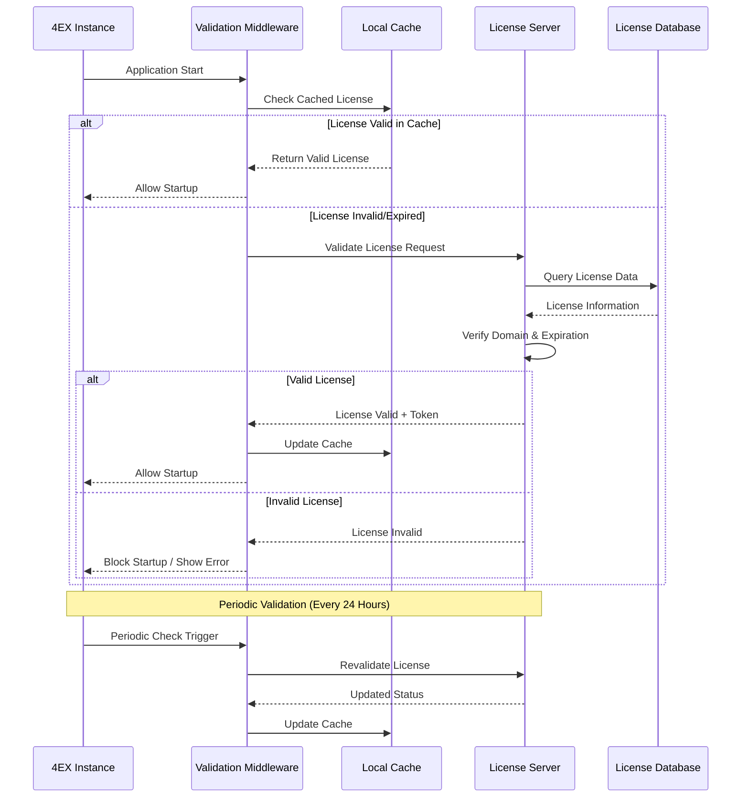
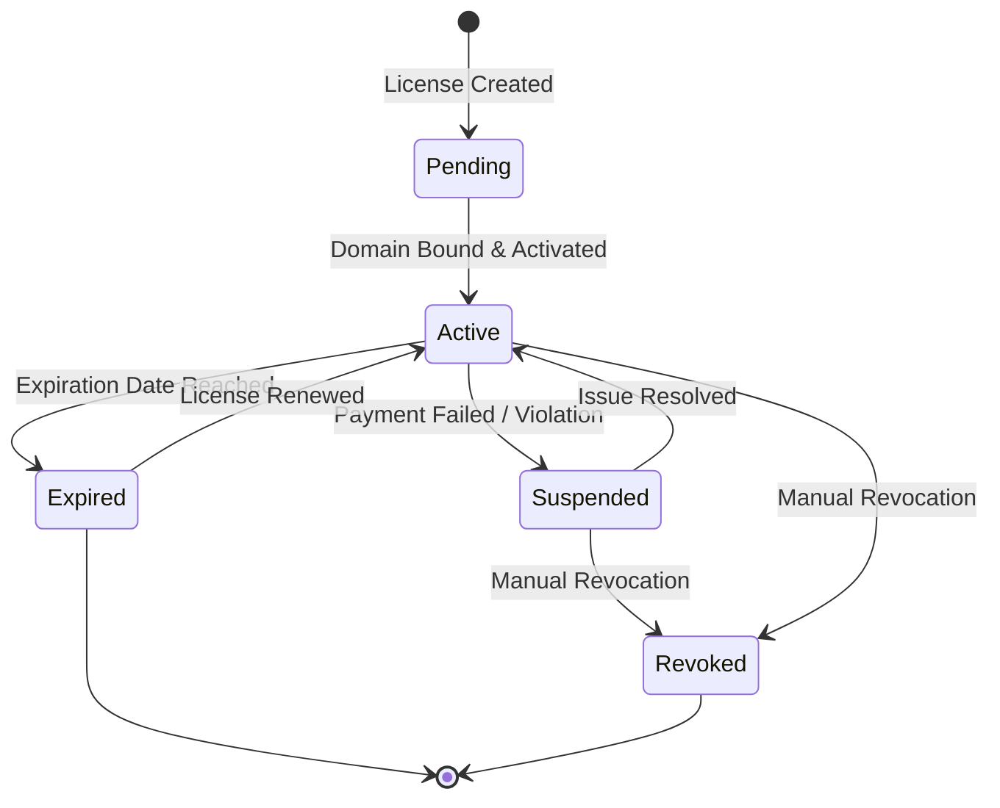
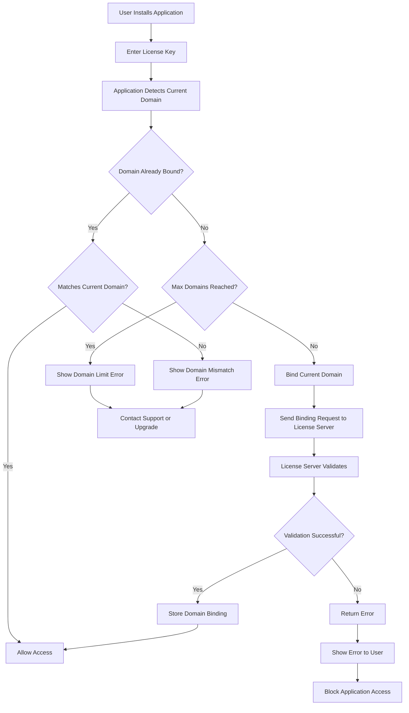
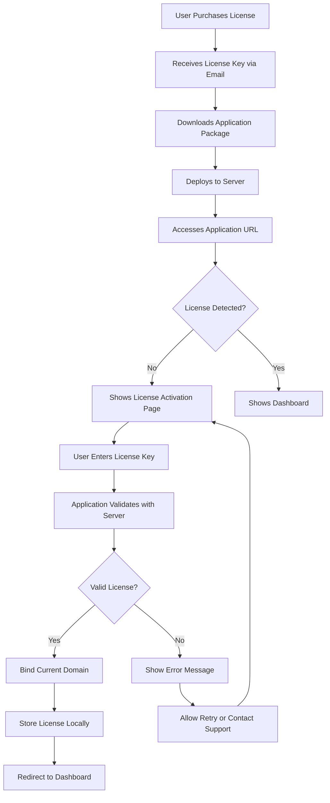

# License Server Validation and Domain Binding System

## Overview

This design document outlines the implementation of a server-side license validation system for the 4EX Exchange platform. The system will enable license-based distribution of the application, ensuring each instance is properly authorized and bound to a specific domain, preventing unauthorized deployment and usage.

## Business Context

### Purpose
Enable commercial distribution of the 4EX Exchange platform with license-based access control, allowing users to purchase licenses and install the application on their own servers while maintaining control over authorized deployments.

### Target Users
- **License Purchasers**: Customers who buy licenses to run the exchange platform on their infrastructure
- **Platform Administrators**: Staff who manage license issuance and monitoring
- **System Administrators**: Technical personnel who install and configure instances

### Business Goals
- Control software distribution and prevent unauthorized usage
- Enable revenue generation through license sales
- Track active deployments and usage metrics
- Provide different licensing tiers (trial, standard, enterprise)
- Ensure license compliance across all deployments

## System Architecture

### High-Level Components

The licensing system consists of four main components:

1. **License Server** (Central Authority)
   - Issues and validates licenses
   - Manages domain bindings
   - Tracks active installations
   - Handles license lifecycle

2. **Client Application** (4EX Exchange Instance)
   - Performs license validation on startup and periodically
   - Enforces license restrictions
   - Reports usage metrics
   - Handles license expiration gracefully

3. **License Management Dashboard**
   - Administrative interface for license creation and management
   - Analytics and monitoring tools
   - Customer license portal

4. **Validation Middleware**
   - Intercepts requests to verify license status
   - Enforces domain restrictions
   - Manages grace periods

### Component Interaction Flow

## License Model

### License Types

| License Type | Duration | Features | Max Domains | Price Point |
|-------------|----------|----------|-------------|-------------|
| Trial | 14 days | Limited features, watermark displayed | 1 | Free |
| Standard | 1 year | Full features, single domain | 1 | Base price |
| Professional | 1 year | Full features, priority support | 3 | 2x base price |
| Enterprise | Custom | Full features, custom branding, dedicated support | Unlimited | Custom pricing |
| Lifetime | Perpetual | Full features, lifetime updates | 5 | 5x base price |

### License Information Structure

Each license contains the following information:

| Field | Type | Description | Example |
|-------|------|-------------|---------|
| License Key | String (UUID) | Unique identifier for the license | `LIC-XXXX-XXXX-XXXX-XXXX` |
| License Type | Enum | Type of license (trial, standard, etc.) | `standard` |
| Customer ID | String | Reference to customer account | `CUST-12345` |
| Customer Email | String | Contact email for license holder | `customer@example.com` |
| Issued Date | Timestamp | When license was created | `2024-01-15T10:00:00Z` |
| Expiration Date | Timestamp | When license expires (null for lifetime) | `2025-01-15T10:00:00Z` |
| Bound Domains | Array | List of authorized domains | `["exchange.example.com"]` |
| Max Domains | Integer | Maximum number of domains allowed | `1` |
| Features Enabled | Object | Feature flags for this license | `{"crypto": true, "telegram": true}` |
| Status | Enum | Current license state | `active` |
| Last Validated | Timestamp | Last successful validation | `2024-11-22T14:30:00Z` |
| Validation Count | Integer | Number of times validated | `245` |
| IP Restrictions | Array | Allowed IP addresses (optional) | `["192.168.1.0/24"]` |
| Hardware ID | String | Server hardware fingerprint (optional) | `HW-ABC123` |

### License States

## Domain Binding Mechanism

### Domain Validation Process

The system validates domains through multiple checks:

1. **Exact Domain Match**: The request origin must exactly match one of the bound domains
2. **Protocol Verification**: Enforce HTTPS for production licenses (HTTP allowed for trial/development)
3. **Subdomain Handling**: Optionally allow subdomains based on license configuration
4. **Port Consideration**: Standard ports (80, 443) are ignored, custom ports must match

### Domain Binding Flow

### Domain Change Handling

When a customer needs to change domains:

1. **Self-Service Portal**: Customer logs into license management portal
2. **Domain Unbinding**: Customer removes old domain from license
3. **Grace Period**: 24-hour waiting period before domain slot becomes available
4. **New Domain Binding**: Customer can bind new domain after grace period
5. **Automatic Notifications**: Email alerts sent for all domain changes

### Anti-Abuse Measures

| Measure | Description | Implementation |
|---------|-------------|----------------|
| Domain Change Limit | Maximum 3 domain changes per month | Tracked in license database |
| Waiting Period | 24-hour cooldown between unbind and rebind | Timestamp-based enforcement |
| IP Monitoring | Alert on suspicious IP patterns | Anomaly detection algorithm |
| Hardware Fingerprinting | Optional hardware ID binding for enterprise | System UUID collection |
| Geolocation Tracking | Monitor deployment locations | IP geolocation service |
| Concurrent Connection Limits | Prevent license sharing across multiple servers | Active session tracking |

## Validation Mechanisms

### Startup Validation

When the application starts:

1. **License File Check**: Verify local license file exists and is not corrupted
2. **License Signature Verification**: Validate cryptographic signature using public key
3. **Expiration Check**: Verify license has not expired
4. **Domain Validation**: Confirm current domain matches license bindings
5. **Online Validation**: Connect to license server for fresh validation (with timeout fallback)
6. **Feature Flag Loading**: Load enabled features based on license type
7. **Grace Period Handling**: Allow startup if within grace period despite validation failure

### Periodic Validation

Runtime validation occurs at regular intervals:

| Validation Type | Frequency | Purpose | Action on Failure |
|----------------|-----------|---------|-------------------|
| Light Check | Every 4 hours | Verify cached license is still valid | Use cached license until next check |
| Full Check | Every 24 hours | Complete validation with license server | Enter grace period mode |
| Feature Validation | On feature access | Verify specific feature is enabled | Block feature, show upgrade prompt |
| Domain Revalidation | On each request (cached) | Confirm domain still matches | Reject request with 403 error |

### Offline Grace Period

To handle temporary network issues:

- **Grace Period Duration**: 7 days from last successful validation
- **Degraded Mode**: After 3 days, show warning banner to administrators
- **Feature Restrictions**: After 5 days, disable non-critical features
- **Complete Lockout**: After 7 days, block all access except to license configuration page

### Validation Response Format

The license server responds to validation requests with structured data:

| Field | Type | Description |
|-------|------|-------------|
| valid | Boolean | Whether license is currently valid |
| license_key | String | The validated license key |
| license_type | String | Type of license |
| expires_at | Timestamp | Expiration date (null for lifetime) |
| days_remaining | Integer | Days until expiration |
| features | Object | Enabled feature flags |
| domain_match | Boolean | Whether domain validation passed |
| message | String | Human-readable status message |
| next_check | Integer | Seconds until next required check |
| token | String | JWT token for subsequent requests |

## Technical Implementation Strategy

### Backend Architecture

The license validation system requires a dedicated backend service:

#### Technology Stack Recommendations

| Component | Technology | Rationale |
|-----------|-----------|-----------|
| License Server | Node.js + Express or Python + FastAPI | Fast development, easy integration with existing stack |
| Database | PostgreSQL | ACID compliance, reliable for license data |
| Cache | Redis | Fast validation response, reduce database load |
| Authentication | JWT (JSON Web Tokens) | Stateless authentication for validation requests |
| Encryption | RSA-2048 or Ed25519 | License signature verification |
| API Protocol | REST + HTTPS | Simple, secure, widely supported |

#### License Server API Endpoints

| Endpoint | Method | Purpose | Authentication |
|----------|--------|---------|----------------|
| `/api/license/validate` | POST | Validate license key and domain | License Key |
| `/api/license/activate` | POST | Activate new license and bind domain | License Key |
| `/api/license/bind-domain` | POST | Add domain to existing license | JWT Token |
| `/api/license/unbind-domain` | DELETE | Remove domain from license | JWT Token |
| `/api/license/status` | GET | Get current license status | JWT Token |
| `/api/license/heartbeat` | POST | Periodic check-in from active instance | JWT Token |
| `/api/license/features` | GET | Retrieve enabled features | JWT Token |

### Client-Side Integration

#### Environment Configuration

The application requires license configuration during deployment:

**Environment Variables Required:**

| Variable | Description | Example |
|----------|-------------|---------|
| `LICENSE_KEY` | The purchased license key | `LIC-1234-5678-ABCD-EFGH` |
| `LICENSE_SERVER_URL` | License validation server URL | `https://licenses.4ex.com` |
| `LICENSE_PUBLIC_KEY` | Public key for signature verification | `-----BEGIN PUBLIC KEY-----...` |
| `LICENSE_CHECK_INTERVAL` | Hours between validation checks | `24` |
| `LICENSE_GRACE_PERIOD` | Days allowed in grace period | `7` |

#### Validation Middleware Implementation

The validation middleware should:

1. **Initialize on Application Startup**
   - Load license from environment variables or configuration file
   - Verify license file signature
   - Perform initial validation with license server
   - Cache validation result

2. **Intercept HTTP Requests**
   - Check cached license validity before processing requests
   - Inject license status into request context
   - Block requests if license is invalid (outside grace period)
   - Add license information to response headers (for debugging)

3. **Periodic Validation**
   - Schedule background tasks for periodic validation
   - Update cache with fresh license data
   - Trigger grace period warnings
   - Log validation events

4. **Handle Validation Failures**
   - Implement exponential backoff for retries
   - Use cached license during network issues
   - Display user-friendly error messages
   - Provide clear path to resolution

#### Frontend License Status Display

Users and administrators should be able to view license status:

**Admin Dashboard Section:**

| Information Displayed | Purpose |
|----------------------|---------|
| License Type | Show current license tier |
| Expiration Date | Alert before expiration |
| Bound Domains | Display configured domains |
| Days Remaining | Countdown to expiration |
| Validation Status | Last successful validation timestamp |
| Feature Restrictions | Show disabled features |
| Renewal Link | Direct link to purchase portal |

**Warning Banners:**

- **30 Days Before Expiration**: Yellow banner suggesting renewal
- **7 Days Before Expiration**: Orange banner with urgent renewal message
- **Grace Period Active**: Red banner indicating validation failure
- **License Expired**: Full-page overlay preventing usage

### Database Schema

#### License Table

| Column | Type | Constraints | Description |
|--------|------|-------------|-------------|
| id | UUID | PRIMARY KEY | Unique license identifier |
| license_key | VARCHAR(64) | UNIQUE, NOT NULL | Human-readable license key |
| customer_id | UUID | FOREIGN KEY, NOT NULL | Reference to customers table |
| license_type | ENUM | NOT NULL | Type of license |
| status | ENUM | NOT NULL, DEFAULT 'pending' | Current license state |
| issued_at | TIMESTAMP | NOT NULL | Creation timestamp |
| expires_at | TIMESTAMP | NULLABLE | Expiration (null for lifetime) |
| max_domains | INTEGER | NOT NULL | Maximum allowed domains |
| features | JSONB | NOT NULL | Enabled features configuration |
| metadata | JSONB | NULLABLE | Additional custom data |
| created_at | TIMESTAMP | NOT NULL, DEFAULT NOW() | Record creation |
| updated_at | TIMESTAMP | NOT NULL, DEFAULT NOW() | Last update |

#### Domain Bindings Table

| Column | Type | Constraints | Description |
|--------|------|-------------|-------------|
| id | UUID | PRIMARY KEY | Unique binding identifier |
| license_id | UUID | FOREIGN KEY, NOT NULL | Reference to licenses table |
| domain | VARCHAR(255) | NOT NULL | Bound domain name |
| protocol | VARCHAR(10) | NOT NULL | HTTP or HTTPS |
| bound_at | TIMESTAMP | NOT NULL | When domain was bound |
| last_validated | TIMESTAMP | NOT NULL | Last validation timestamp |
| validation_count | INTEGER | NOT NULL, DEFAULT 0 | Total validations performed |
| ip_address | VARCHAR(45) | NULLABLE | Last known IP address |
| hardware_id | VARCHAR(255) | NULLABLE | Server hardware fingerprint |
| is_active | BOOLEAN | NOT NULL, DEFAULT true | Whether binding is active |
| created_at | TIMESTAMP | NOT NULL, DEFAULT NOW() | Record creation |

#### Validation Log Table

| Column | Type | Constraints | Description |
|--------|------|-------------|-------------|
| id | UUID | PRIMARY KEY | Unique log entry identifier |
| license_id | UUID | FOREIGN KEY, NOT NULL | Reference to licenses table |
| domain | VARCHAR(255) | NOT NULL | Domain making request |
| validation_result | ENUM | NOT NULL | Success, failure, grace_period |
| ip_address | VARCHAR(45) | NOT NULL | Request origin IP |
| user_agent | TEXT | NULLABLE | Client user agent string |
| error_message | TEXT | NULLABLE | Error details if failed |
| validated_at | TIMESTAMP | NOT NULL, DEFAULT NOW() | Validation timestamp |

#### Customers Table

| Column | Type | Constraints | Description |
|--------|------|-------------|-------------|
| id | UUID | PRIMARY KEY | Unique customer identifier |
| email | VARCHAR(255) | UNIQUE, NOT NULL | Customer email address |
| name | VARCHAR(255) | NOT NULL | Customer full name |
| company | VARCHAR(255) | NULLABLE | Company name |
| status | ENUM | NOT NULL, DEFAULT 'active' | Account status |
| created_at | TIMESTAMP | NOT NULL, DEFAULT NOW() | Account creation |
| updated_at | TIMESTAMP | NOT NULL, DEFAULT NOW() | Last update |

### Security Considerations

#### License Key Protection

| Security Measure | Implementation |
|-----------------|----------------|
| Encryption at Rest | Encrypt license keys in database using AES-256 |
| Secure Transmission | Always use HTTPS for license validation requests |
| Key Obfuscation | Never expose full license keys in client-side code |
| Signature Verification | Use asymmetric cryptography to prevent tampering |
| Rate Limiting | Prevent brute force attacks on validation endpoints |

#### Preventing Circumvention

| Threat | Mitigation Strategy |
|--------|---------------------|
| License Cloning | Bind to hardware fingerprint and track concurrent usage |
| Time Manipulation | Use server time, not client time for expiration checks |
| Code Modification | Use code obfuscation and integrity checks |
| Proxy Bypass | Validate domain at multiple application layers |
| Debugging/Reverse Engineering | Implement anti-tampering checks in compiled code |

#### Data Privacy

- **Minimal Data Collection**: Only collect data necessary for license validation
- **GDPR Compliance**: Provide data export and deletion capabilities
- **Data Retention**: Automatically purge old validation logs after 90 days
- **Customer Consent**: Clearly communicate what data is collected and why

## User Experience

### Installation and Activation Flow

### License Activation Interface

**Required Fields:**

| Field | Type | Validation | Description |
|-------|------|-----------|-------------|
| License Key | Text Input | Format: LIC-XXXX-XXXX-XXXX-XXXX | The purchased license key |
| Customer Email | Email Input | Valid email format | Email used during purchase |
| Domain Confirmation | Readonly Display | Auto-detected | Shows domain being bound |
| Terms Agreement | Checkbox | Required | Agreement to license terms |

**User Feedback:**

- Display progress indicator during validation
- Show clear success message with license details
- Provide actionable error messages with support contact
- Offer "Test Connection" button to verify license server accessibility

### Error Handling and User Communication

#### Error Scenarios and Messages

| Scenario | User-Facing Message | Recommended Action |
|----------|---------------------|-------------------|
| Invalid License Key | "The license key you entered is not valid. Please check and try again." | Verify key format, contact support |
| Expired License | "Your license expired on [date]. Please renew to continue using the platform." | Provide renewal link |
| Domain Limit Reached | "This license is already bound to the maximum number of domains. Please unbind an existing domain or upgrade your license." | Link to domain management |
| Domain Mismatch | "This license is bound to [domain], but you are accessing from [current-domain]." | Instructions to update domain |
| License Server Unreachable | "Unable to validate license. Operating in grace period mode. Days remaining: [X]" | Check network, show status page |
| License Suspended | "Your license has been suspended. Please contact support for assistance." | Support contact information |
| License Revoked | "This license has been revoked and can no longer be used." | Contact support or purchase new |

#### Grace Period User Experience

During grace period:

1. **Day 1-3**: Small warning badge in admin panel, no functional restrictions
2. **Day 4-5**: Yellow banner at top of all pages, daily email reminder to administrator
3. **Day 6-7**: Orange banner, hourly reminders, disable non-critical features
4. **Day 7+**: Full-page overlay, read-only mode, show only license configuration

## Monitoring and Analytics

### License Server Metrics

Track the following metrics for business intelligence:

| Metric | Purpose | Visualization |
|--------|---------|---------------|
| Total Active Licenses | Monitor business growth | Line chart over time |
| Licenses by Type | Understand customer distribution | Pie chart |
| Validation Request Volume | Monitor system load | Time series graph |
| Failed Validations | Identify issues or abuse | Alert threshold + list |
| Expiring Soon | Proactive renewal campaigns | Table sorted by days remaining |
| Domain Changes | Detect unusual patterns | Event log with analytics |
| Geographic Distribution | Understand market reach | World map visualization |
| Average Validation Response Time | System performance monitoring | Real-time gauge |

### Alerting System

Configure alerts for critical events:

| Event | Alert Recipients | Alert Medium | Priority |
|-------|-----------------|--------------|----------|
| License Expired | Customer + Sales Team | Email | Medium |
| Domain Change | Customer + Security Team | Email + SMS | High |
| Validation Failure Spike | Operations Team | Slack + Email | High |
| License Server Down | Operations Team | PagerDuty | Critical |
| Suspicious Activity | Security Team | Email + Dashboard | High |
| Hardware Mismatch | Customer + Security | Email | Medium |

## Migration and Rollout Strategy

### Phase 1: Infrastructure Setup

**Objective**: Establish license server and database infrastructure

**Tasks**:
- Set up license server on isolated infrastructure
- Configure PostgreSQL database with proper schemas
- Implement Redis cache for performance
- Set up monitoring and alerting
- Configure SSL certificates for HTTPS
- Deploy backup and disaster recovery procedures

**Success Criteria**: License server responds to health checks with 99.9% uptime

### Phase 2: License Management Dashboard

**Objective**: Create administrative interface for license management

**Tasks**:
- Build license CRUD operations interface
- Implement customer management system
- Create domain binding management UI
- Develop analytics dashboard
- Build customer self-service portal
- Implement email notification system

**Success Criteria**: Admin can create, view, modify, and revoke licenses through UI

### Phase 3: Client Integration

**Objective**: Integrate validation into 4EX Exchange application

**Tasks**:
- Implement validation middleware
- Create license activation page
- Add license status display in admin panel
- Implement grace period handling
- Add error messaging and user guidance
- Create deployment documentation

**Success Criteria**: Application successfully validates license on startup and periodically

### Phase 4: Testing and Validation

**Objective**: Thoroughly test all scenarios

**Test Cases**:
- Valid license activation
- Expired license handling
- Domain mismatch detection
- Maximum domain limit enforcement
- Grace period functionality
- Network failure resilience
- License renewal process
- Domain change workflow
- License revocation
- Performance under load

**Success Criteria**: All test cases pass with expected behavior

### Phase 5: Pilot Deployment

**Objective**: Deploy to limited customer base for real-world testing

**Activities**:
- Select 5-10 pilot customers
- Provide dedicated support channel
- Monitor all validation requests closely
- Collect feedback on user experience
- Measure system performance
- Identify and fix issues

**Success Criteria**: Pilot customers successfully activate and use licensed instances

### Phase 6: Full Production Rollout

**Objective**: Deploy license system to all new customers

**Activities**:
- Update sales and distribution process
- Train support team on licensing system
- Update all documentation
- Announce new licensing model
- Migrate existing customers (with grace period)
- Monitor adoption and issues

**Success Criteria**: All new deployments use licensed versions

## Maintenance and Operations

### Routine Operations

| Task | Frequency | Owner | Purpose |
|------|-----------|-------|---------|
| Database Backup | Daily | DevOps | Disaster recovery |
| Log Review | Daily | Operations | Identify issues |
| Performance Monitoring | Continuous | DevOps | Ensure SLA compliance |
| Security Audit | Monthly | Security Team | Identify vulnerabilities |
| License Expiration Notices | Daily | Automated System | Customer communication |
| Validation Log Cleanup | Weekly | Automated Task | Database maintenance |

### Customer Support Procedures

**Common Support Scenarios:**

1. **Lost License Key**
   - Verify customer identity
   - Retrieve license from customer record
   - Send via secure email

2. **Domain Change Request**
   - Verify customer identity
   - Check domain change history
   - Approve unbinding if within limits
   - Provide instructions for rebinding

3. **License Not Validating**
   - Check license server status
   - Verify domain binding
   - Check for network issues on customer side
   - Review validation logs for errors

4. **Upgrade Request**
   - Process upgrade payment
   - Update license type in system
   - Notify customer of changes
   - Verify new features are accessible

### Disaster Recovery

**Backup Strategy:**
- Database backups every 4 hours with 30-day retention
- License files stored in object storage with versioning
- Configuration backup daily
- Full system snapshots weekly

**Recovery Procedures:**
- **License Server Failure**: Automatic failover to standby server within 5 minutes
- **Database Corruption**: Restore from most recent backup (maximum 4-hour data loss)
- **Network Partition**: Clients operate in grace period until connectivity restored
- **Complete Disaster**: Restore from off-site backup within 24 hours

## Future Enhancements

### Potential Advanced Features

| Feature | Description | Business Value | Complexity |
|---------|-------------|----------------|-----------|
| Usage-Based Licensing | Charge based on transaction volume | Flexible pricing model | High |
| Feature Add-ons | Allow purchasing individual features | Increased revenue per customer | Medium |
| Multi-Tenant Licenses | Single license for multiple subdomains | Enterprise convenience | Medium |
| Floating Licenses | License pool shared across domains | Enterprise flexibility | High |
| Automatic Renewal | Auto-charge before expiration | Reduce churn | Low |
| White-Label Licensing | Reseller program with sub-licenses | Partner channel expansion | High |
| Blockchain Licensing | Store licenses on blockchain | Transparency and immutability | High |
| API Access Metering | Track and limit API usage | Control resource consumption | Medium |

### Integration Opportunities

- **Payment Gateway Integration**: Automated license purchase and renewal
- **CRM Integration**: Sync license data with customer relationship management
- **Analytics Platforms**: Export usage data to business intelligence tools
- **Support Ticketing**: Automatic ticket creation for license issues
- **Marketplace Listing**: Integration with software marketplaces

## Compliance and Legal

### License Agreement Terms

The license agreement should clearly specify:

- **Grant of License**: What rights are granted to the licensee
- **Restrictions**: Prohibited uses (redistribution, reverse engineering, etc.)
- **Domain Binding**: Explanation of domain restrictions
- **Support and Updates**: What support and updates are included
- **Warranty Disclaimer**: Limitation of liability
- **Termination Conditions**: When license can be revoked
- **Data Collection**: What data is collected during validation
- **Privacy Policy**: How customer data is used and protected

### Regional Considerations

| Region | Consideration | Implementation |
|--------|--------------|----------------|
| European Union | GDPR compliance required | Data export/deletion APIs, consent tracking |
| California | CCPA compliance | Privacy notices, opt-out mechanisms |
| China | Data localization | Deploy separate license server in China |
| Russia | Data sovereignty | Store Russian customer data domestically |

## Success Metrics

### Key Performance Indicators

| KPI | Target | Measurement Method |
|-----|--------|-------------------|
| License Activation Success Rate | > 95% | (Successful Activations / Total Attempts) × 100 |
| Validation Response Time | < 200ms | Average P95 response time |
| System Uptime | > 99.9% | Total uptime / Total time |
| Grace Period Utilization | < 5% | Licenses in grace period / Total active |
| Customer Satisfaction | > 4.5/5 | Post-activation survey |
| License Renewal Rate | > 80% | Renewals / Expirations |
| Support Ticket Volume | < 2% of licenses | License-related tickets / Total licenses |

### Business Success Criteria

- **Revenue Protection**: Reduce unauthorized usage by 95%
- **Customer Experience**: License activation takes less than 5 minutes
- **Operational Efficiency**: Automated renewal reduces manual processing by 80%
- **Market Expansion**: Enable distribution in new markets with regional compliance
- **Customer Retention**: Renewal rate above 80% indicates value delivery

## Appendix

### Glossary

| Term | Definition |
|------|------------|
| License Key | Unique identifier that authorizes use of the software |
| Domain Binding | Association of a license with specific domain name(s) |
| Validation | Process of verifying license authenticity and status |
| Grace Period | Time allowed for operation after validation failure |
| Hardware Fingerprint | Unique identifier for server hardware |
| License Server | Central server that issues and validates licenses |
| Activation | Process of initially binding license to installation |

### Reference Links

- RFC 3986: Uniform Resource Identifier (URI) syntax
- JWT Specification: JSON Web Token standard
- HTTPS Best Practices: TLS 1.3 configuration
- GDPR Compliance Guide: Data protection regulation
- ISO 27001: Information security management

### Contact Information

| Role | Contact Method | Purpose |
|------|---------------|---------|
| License Support | licenses@4ex.com | License activation and issues |
| Technical Support | support@4ex.com | Installation and configuration |
| Sales Team | sales@4ex.com | License purchases and upgrades |
| Security Team | security@4ex.com | Report security issues |
