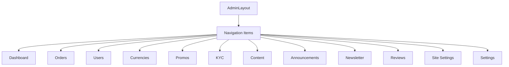

# Multi-Language Support for Admin Interface

## Overview

Extend the existing multilingual system (Russian and English) to the administrative interface of the 4EX currency exchange platform. Currently, the admin panel is available only in Russian. This feature will provide full English language support for all admin pages while leveraging the existing translation infrastructure.

## Current State

The platform has a functioning multilingual system supporting Russian and English for the public interface, including:

- Language store with localStorage persistence
- Translation dictionary in `src/locales/translations.ts` with hierarchical structure
- `useTranslation()` hook providing translation function
- LanguageSelector component in the header
- Browser language detection on first visit

The admin section (`admin` namespace) exists in the translations but contains only basic navigation labels. Admin pages currently use hard-coded Russian text.

## Design Goals

- Provide complete English language support for all admin interface components
- Maintain consistency with existing translation patterns and naming conventions
- Enable seamless language switching within the admin panel
- Ensure all text elements are translatable (labels, buttons, messages, notifications)
- Preserve existing admin functionality without regression

## Scope

### In Scope

Admin pages requiring translation:
- AdminDashboard
- AdminOrders
- AdminCurrencies
- AdminSettings
- AdminPromos
- AdminKYC
- AdminUsers
- AdminReviews
- AdminContent
- AdminNewsletter
- AdminAnnouncements
- AdminSiteSettings
- AdminLogin
- AdminLayout (navigation and UI elements)

### Out of Scope

- Public-facing pages (already implemented)
- User dashboard and settings (already implemented)
- Backend or API responses
- Database schema changes

## Translation Structure

The translation keys will be organized under the `admin` namespace with the following hierarchical structure:

```
translations.admin
├── common (shared admin labels and messages)
├── navigation (admin menu items)
├── dashboard (dashboard page)
├── orders (order management)
├── currencies (currency management)
├── settings (system settings)
├── promos (promo code management)
├── kyc (KYC verification management)
├── users (user management)
├── reviews (review management)
├── content (content management)
├── newsletter (newsletter management)
├── announcements (announcement management)
├── siteSettings (site configuration)
└── login (admin login)
```

### Translation Key Organization

Each section will follow the pattern:

| Category | Structure | Example |
|----------|-----------|---------|
| Page titles | `admin.{section}.title` | `admin.dashboard.title` |
| Subtitles | `admin.{section}.subtitle` | `admin.orders.subtitle` |
| Field labels | `admin.{section}.labels.{field}` | `admin.settings.labels.commission` |
| Button text | `admin.{section}.buttons.{action}` | `admin.currencies.buttons.addNew` |
| Messages | `admin.{section}.messages.{type}` | `admin.orders.messages.statusUpdated` |
| Status values | `admin.{section}.status.{value}` | `admin.orders.status.completed` |

## Implementation Strategy

### Phase 1: Translation Dictionary Extension

Extend `src/locales/translations.ts` with comprehensive admin translations for both Russian and English languages.

#### Common Admin Translations

Shared labels, buttons, and messages used across multiple admin pages:

- Action buttons (save, cancel, delete, edit, add, remove, update, export, import, etc.)
- Common labels (status, date, created, updated, email, name, etc.)
- Filter and search labels
- Pagination controls
- Modal actions
- Status indicators
- Success/error/warning messages

#### Page-Specific Translations

Each admin page requires dedicated translations for:

**AdminDashboard:**
- Page title and description
- Statistics cards (total orders, pending, completed, active users)
- Quick action cards
- Volume statistics labels

**AdminOrders:**
- Order management interface labels
- Search and filter controls
- Order status labels and descriptions
- Order details modal
- Contact information labels
- Payment details labels
- Action buttons for order processing
- Pagination text
- Summary statistics

**AdminCurrencies:**
- Currency list management
- Add/edit currency forms
- Currency types and categories
- Network selection labels
- Crypto integration labels
- Reserve and limit fields
- Import/export functionality

**AdminSettings:**
- Commission settings
- General settings
- SMTP configuration
- Support contact settings
- Maintenance mode labels
- Auto-confirmation thresholds

**AdminPromos:**
- Promo code management
- Discount types
- Usage limits
- Validity periods
- Code generation

**AdminKYC:**
- Verification levels
- Document types
- Status labels
- Review actions
- Rejection reasons

**AdminUsers:**
- User list management
- User details
- Role management
- Status filters
- Activity tracking

**AdminReviews:**
- Review moderation
- Rating display
- Response interface
- Approval/rejection actions

**AdminContent:**
- Content sections
- Editor labels
- Publishing controls

**AdminNewsletter:**
- Subscription management
- Campaign creation
- Sending controls
- Statistics

**AdminAnnouncements:**
- Announcement creation
- Visibility settings
- Priority levels
- Scheduling

**AdminSiteSettings:**
- Site configuration
- Multi-language content fields
- Theme settings
- Feature toggles

**AdminLogin:**
- Login form labels
- Authentication messages
- Error notifications

**AdminLayout:**
- Navigation menu items
- User information display
- Logout button
- Return to site link

### Phase 2: Component Integration

Update admin components to use the translation system:

#### Hook Integration

Each admin component will integrate the `useTranslation` hook:

```
const { t } = useTranslation();
```

#### Text Replacement Pattern

All hard-coded Russian text will be replaced with translation function calls:

| Current (Russian) | Replacement Pattern |
|------------------|---------------------|
| Hard-coded string | `t('admin.section.key')` |
| Button text | `t('admin.common.buttons.action')` |
| Labels | `t('admin.section.labels.field')` |
| Messages | `t('admin.section.messages.type')` |

#### Toast Notifications

All toast notification messages will use translated strings:

```
toast.success(t('admin.section.messages.success'))
toast.error(t('admin.section.messages.error'))
```

#### Dynamic Values

For messages with dynamic content, the translation system will support interpolation through string replacement or template literals.

### Phase 3: AdminLayout Enhancement

The AdminLayout component requires special attention as it controls the overall admin interface structure:

#### Language Selector Integration

Add the existing LanguageSelector component to the admin top bar alongside the theme toggle and logout button.

**Positioning:**
- Located in the top-right area
- Placed between username display and theme toggle
- Maintains consistent styling with other header elements

#### Navigation Menu Translation

Update all navigation menu items to use translations:



Each navigation item will reference `t('admin.navigation.{item}')`.

#### UI Elements

Additional UI elements requiring translation:
- Username label or greeting
- Logout button text
- "Return to site" link text
- Admin panel title/branding text

### Phase 4: Validation and Quality Assurance

Quality checks to ensure translation completeness:

#### Coverage Verification

- All visible text elements are translatable
- No hard-coded Russian strings remain
- No untranslated keys appear in the UI
- Fallback behavior works correctly

#### Translation Quality

- English translations are accurate and natural
- Technical terminology is consistent
- UI text fits within component boundaries
- Plural forms handled correctly (if applicable)

#### Functional Testing

- Language switching works seamlessly
- Language preference persists across sessions
- No layout breaks with different text lengths
- All dynamic content displays correctly in both languages

## Translation Approach

### Text Adaptation Guidelines

| Element Type | Approach |
|--------------|----------|
| Technical terms | Use industry-standard English equivalents |
| UI labels | Keep concise, consistent with public interface |
| Messages | Maintain tone and clarity |
| Status values | Use standardized terminology |
| Buttons | Action-oriented, clear intent |

### Consistency Requirements

- Reuse existing common translations where applicable
- Follow the same camelCase naming convention
- Maintain 3-level maximum hierarchy
- Align with public interface terminology
- Use consistent action verbs (save, update, delete, etc.)

## Language Switching Behavior

The admin interface will respect the global language setting:

**Language Persistence:**
- Language selection is stored in localStorage under `language-storage`
- Shared between public and admin interfaces
- Survives browser refresh and logout/login cycles

**Switching Mechanism:**
- LanguageSelector component in admin top bar
- Immediate UI update upon selection
- No page reload required
- Consistent with public interface behavior

**Default Language:**
- Follows browser language detection
- Falls back to Russian if not English
- Admin login page respects this setting

## Notification Translation

Admin notifications (toast messages) will be fully translatable:

**Message Types:**
| Type | Pattern | Example Key |
|------|---------|-------------|
| Success | `admin.{section}.messages.{action}Success` | `admin.orders.messages.statusUpdated` |
| Error | `admin.{section}.messages.{action}Error` | `admin.currencies.messages.saveError` |
| Warning | `admin.{section}.messages.{action}Warning` | `admin.settings.messages.invalidCommission` |
| Info | `admin.{section}.messages.{action}Info` | `admin.kyc.messages.reviewPending` |

## Data Handling Considerations

### Static Content

All static UI text, labels, and messages are fully translatable.

### Dynamic Content

Dynamic data from the system requires special handling:

**Order Status Values:**
- Status values like `waiting_payment`, `completed` use translation keys
- Pattern: `orders.status.{statusValue}`
- Already implemented for public interface, reused in admin

**Currency Names:**
- System currencies have both Russian (`name`) and English (`nameEn`) fields
- Display logic selects appropriate field based on current language
- Custom currencies may require manual translation entry

**User-Generated Content:**
- Reviews, announcements, newsletter content remain in original language
- Admin responses and moderation notes can be in either language
- No automatic translation of user content

### Multi-Language Content Fields

Some admin sections manage content displayed to end users:

**Site Settings:**
- Content fields that appear on the public site should support both languages
- Admin interface labels translated, but content managed separately for each language
- Pattern: separate fields for RU and EN versions

**Announcements:**
- Announcement text may require dual-language entry
- Admin can manage Russian and English versions independently

## Layout and Responsive Considerations

### Text Length Variation

English text may be longer or shorter than Russian:

**Mitigation Strategies:**
- Use flexible layouts (flexbox, grid)
- Avoid fixed-width containers for text
- Test with longest expected translations
- Ensure buttons accommodate text expansion
- Use ellipsis for truncation where appropriate

### UI Component Adaptation

Components that may require adjustment:

| Component | Consideration |
|-----------|---------------|
| Navigation menu | Ensure labels fit in sidebar width |
| Buttons | Accommodate longer action verbs |
| Tables | Column headers may vary in width |
| Modals | Title and message length flexibility |
| Cards | Statistics labels and descriptions |

## Fallback Strategy

Follow the existing fallback mechanism:

1. Try requested language (English or Russian)
2. If key not found, try English
3. If still not found, try Russian
4. If still not found, return the key itself

This ensures graceful degradation if any translations are missing.

## Documentation Updates

The existing multilingual documentation will be updated:

**MULTILINGUAL_IMPLEMENTATION.md:**
- Add section documenting admin interface translation
- Include admin-specific translation key patterns
- Document AdminLayout language selector integration

**MULTILINGUAL_SUMMARY.md:**
- Update completion status to include admin panel
- Note full platform coverage (public + admin)

## Success Criteria

The implementation will be considered complete when:

1. All admin pages display correctly in both Russian and English
2. Language switching in admin interface works seamlessly
3. No hard-coded Russian text remains in admin components
4. Translation coverage is 100% for all visible UI elements
5. Toast notifications appear in the selected language
6. Language preference persists across sessions
7. No layout breaks or UI issues in either language
8. AdminLayout includes functional language selector
9. Navigation menu items are fully translated
10. All admin pages maintain functionality in both languages

## Risks and Mitigation

| Risk | Impact | Mitigation |
|------|--------|-----------|
| Incomplete translation coverage | Medium | Systematic review of all admin components |
| Text length causing layout issues | Low | Responsive design and testing |
| Inconsistent terminology | Low | Glossary of standard translations |
| Missing toast message translations | Medium | Audit all toast.success/error/warning calls |
| Dynamic content not translating | Medium | Clear handling rules for dynamic data |

## Future Enhancements

Potential future improvements not included in this design:

- Additional language support (Spanish, Chinese, etc.)
- Admin interface for managing translations directly
- Automatic translation suggestions for new content
- Language-specific date/time formatting customization
- Right-to-left (RTL) language support
- Per-admin-user language preference (independent of global setting)
