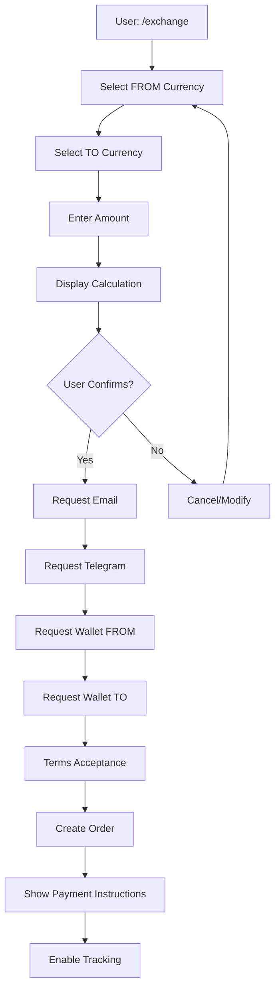
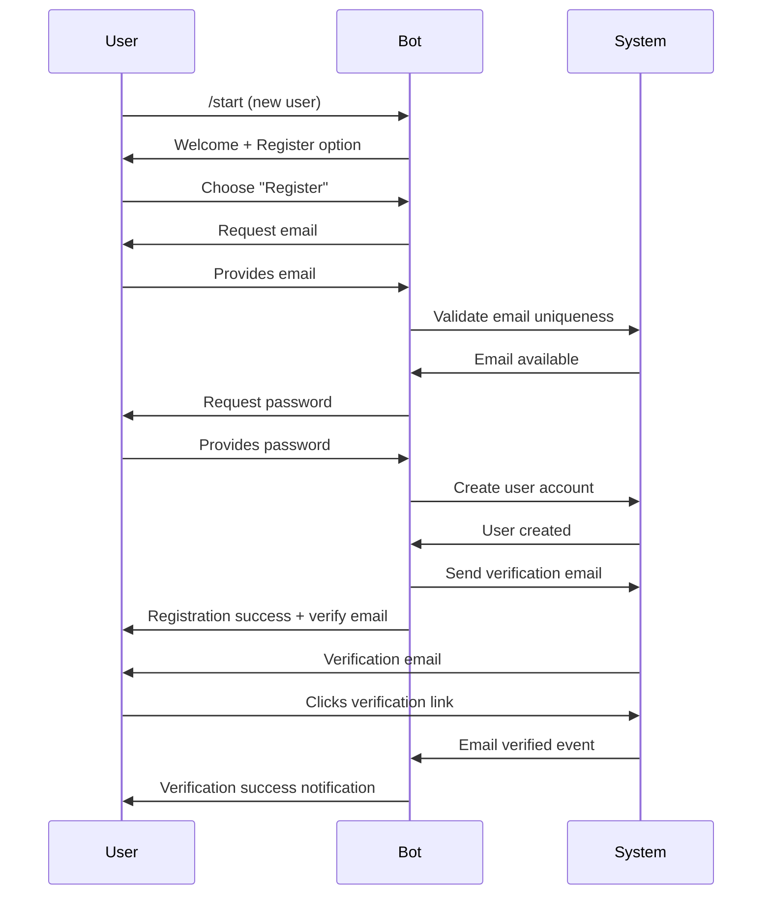
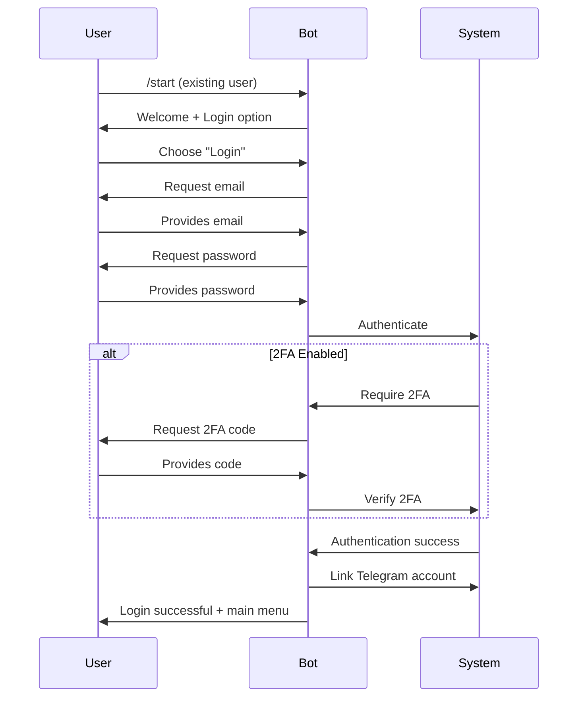
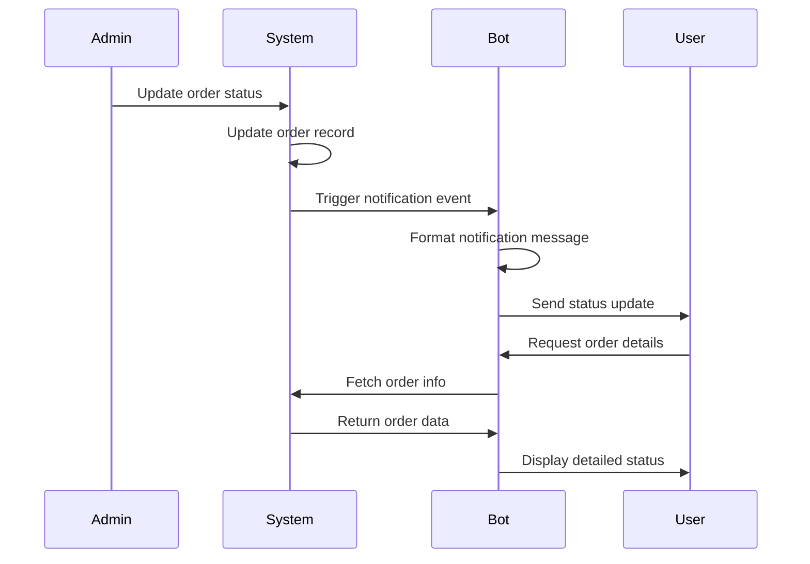

# Telegram Bot Integration Design

## Overview

This design outlines the integration of a Telegram bot that provides complete access to all functionality of the cryptocurrency exchange platform. The bot will serve as an alternative interface to the web application, allowing users to perform exchanges, track orders, manage their accounts, and access all platform features directly through Telegram.

## Strategic Goals

### Primary Objectives

- Enable full platform functionality through Telegram interface
- Provide seamless user experience for both new and existing platform users
- Maintain feature parity with web application
- Ensure secure authentication and authorization
- Support both individual users and administrators

### Value Proposition

- Increased accessibility through mobile-first Telegram interface
- Real-time notifications for order status updates
- Quick access to exchange operations without opening web browser
- Enhanced user engagement through conversational interface
- Lower barrier to entry for new users

## System Architecture

### High-Level Components

The Telegram bot integration consists of the following architectural layers:

| Component | Responsibility | Technology Considerations |
|-----------|---------------|---------------------------|
| Telegram Bot API Layer | Handle incoming messages, commands, and callbacks | Telegram Bot API, webhooks or polling |
| Bot Controller | Route commands to appropriate handlers, manage conversation state | Command routing, session management |
| Business Logic Adapter | Bridge between bot and existing platform logic | Reuse existing stores and services |
| Notification Service | Send proactive updates to users | Queue system, event-driven architecture |
| Data Persistence | Store bot-specific data and user associations | Link Telegram users to platform accounts |

### Integration Approach

The bot will integrate with existing platform components:

- **Exchange Store**: Reuse currency data, rate calculations, and exchange logic
- **User Store**: Link Telegram accounts with platform users, handle authentication
- **Order Store**: Create and track orders initiated through Telegram
- **KYC Store**: Enable identity verification workflows
- **Promo Store**: Apply promotional codes to exchanges
- **Review Store**: Collect feedback on completed exchanges
- **Admin Store**: Provide admin panel access through bot

## User Experience Design

### Bot Interaction Model

The bot will support three primary interaction patterns:

**1. Command-Based Navigation**
- Direct commands for specific actions
- Quick access to frequently used features
- Hierarchical menu structure

**2. Conversational Flows**
- Step-by-step guidance for complex operations
- Context-aware responses
- Input validation with friendly error messages

**3. Inline Keyboards**
- Interactive buttons for selection
- Quick actions on orders and settings
- Navigation between sections

### User Journey Mapping

#### First-Time User Journey

1. User starts bot with `/start` command
2. Welcome message with platform introduction
3. Option to register new account or link existing account
4. Quick tutorial on main features
5. Guided first exchange with assistance

#### Returning User Journey

1. User opens bot
2. Main menu with quick access to:
   - New exchange
   - My orders
   - Track order
   - Account settings
3. Contextual shortcuts based on recent activity

## Functional Requirements

### Core Exchange Operations

#### Currency Exchange Flow

**Initiate Exchange**
- Command: `/exchange` or button from main menu
- Bot presents currency selection interface
- User selects FROM currency
- User selects TO currency
- User enters amount
- Bot calculates and displays exchange details

**Exchange Calculation Display**

The bot will present exchange information in structured format:

- From amount and currency
- To amount and currency
- Exchange rate with timestamp
- Commission percentage and amount
- Total amount to receive
- Currency reserves status
- Rate reservation timer

**Complete Exchange**

Multi-step process:
1. Contact information collection
2. Payment details submission
3. Wallet addresses provision
4. Terms acceptance
5. Order confirmation
6. Payment instructions

#### Order Management

**Order Tracking**
- View all orders with status
- Filter by status or date
- Detailed order information
- Real-time status updates via notifications

**Order Status Notifications**

Automatic notifications for status changes:
- Payment waiting
- Payment received
- Verification in progress
- Sending funds
- Completed
- Cancelled or refunded

### User Account Management

#### Authentication and Registration

**New User Registration**
- Collect email address
- Set password
- Collect name
- Email verification via link
- Automatic Telegram account linking

**Existing User Linking**
- Login with email and password
- 2FA verification if enabled
- Telegram account association
- Session management

**Session Security**
- Secure token storage
- Session timeout handling
- Device verification
- Logout capability

#### Profile Management

Users can manage profile through bot:

| Feature | Description |
|---------|-------------|
| View Profile | Display user information, KYC status, limits |
| Update Email | Change email with verification |
| Change Password | Secure password update flow |
| Enable 2FA | Set up two-factor authentication |
| Disable 2FA | Remove 2FA with verification |
| View Transaction History | List all completed exchanges |
| Manage Notifications | Configure notification preferences |

### KYC Verification

The bot will support multi-level KYC verification:

**KYC Levels**

| Level | Limits | Required Documents |
|-------|--------|-------------------|
| Level 0 | Daily: 500, Monthly: 5000 | None (unverified) |
| Level 1 | Daily: 1000, Monthly: 10000 | ID document photo |
| Level 2 | Daily: 10000, Monthly: 100000 | ID + selfie + proof of address |
| Level 3 | Daily: 50000, Monthly: 500000 | Full KYC package + video call |

**Verification Process**

1. User initiates KYC from profile menu
2. Bot explains level benefits and requirements
3. User selects desired level
4. Bot provides document upload instructions
5. User uploads documents via Telegram file sharing
6. Bot confirms submission
7. Admin reviews documents
8. User receives notification of approval/rejection

### Promotional Features

#### Promo Codes

**Apply Promo Code**
- User enters promo code during exchange
- Bot validates code in real-time
- Displays discount or bonus information
- Applies automatically to calculation

**View Available Promos**
- List active promotional campaigns
- Display eligibility requirements
- Show expiration dates

#### Favorites Management

**Save Favorite Directions**
- Quick-save frequently used currency pairs
- Access favorites from main menu
- One-tap exchange initiation

**Manage Favorites**
- View all saved directions
- Remove favorites
- Reorder by preference

### Review and Feedback System

**Submit Review**
- Available after order completion
- Rate exchange experience (1-5 stars)
- Provide written feedback
- Automatic association with order

**View Reviews**
- Browse published reviews
- Filter by rating or currency pair
- See admin responses

### Administrative Functions

Administrators will have dedicated bot interface:

#### Admin Dashboard Access

**Statistics Overview**
- Total orders count
- Revenue metrics
- Active users count
- Pending KYC requests
- Recent activity summary

#### Order Management

| Function | Description |
|----------|-------------|
| View All Orders | List with filtering and search |
| Update Order Status | Change status with notification trigger |
| View Order Details | Complete order information |
| Add Admin Note | Internal comments on orders |
| Refund Order | Initiate refund process |
| Cancel Order | Cancel with reason |

#### User Management

- View all registered users
- Search users by email or Telegram ID
- View user details and activity
- Ban or unban users
- Review KYC submissions
- Approve or reject verification

#### Content Management

**Currency Management**
- Add new currencies
- Update exchange rates
- Set custom commissions
- Adjust reserves
- Enable or disable currencies

**Promo Code Management**
- Create new promo codes
- Edit existing promos
- Deactivate campaigns
- View usage statistics

**Review Moderation**
- View pending reviews
- Publish or hide reviews
- Respond to reviews
- Delete inappropriate content

#### Site Configuration

- Enable or disable maintenance mode
- Update platform settings
- Configure notification templates
- Manage admin access

### Notification System

#### User Notifications

The bot will send proactive notifications for:

**Order-Related**
- Order created confirmation
- Payment instructions
- Payment received
- Status change updates
- Order completion
- Cancellation alerts

**Account-Related**
- Successful registration
- Email verification reminder
- KYC submission received
- KYC status update
- Security alerts (new device, password change)

**Promotional**
- New promo codes available
- Special offers
- Platform updates

#### Admin Notifications

Administrators receive alerts for:
- New order created
- KYC submission pending
- New user registration
- System errors or issues
- Critical reserve levels

### Notification Preferences

Users can configure:
- Enable or disable notification categories
- Set quiet hours
- Choose notification verbosity
- Email vs Telegram notification routing

## Command Structure

### User Commands

| Command | Function | Access Level |
|---------|----------|--------------|
| `/start` | Initialize bot, show welcome | All |
| `/menu` | Display main menu | All |
| `/exchange` | Start new exchange | Authenticated |
| `/orders` | View order history | Authenticated |
| `/track` | Track specific order | All |
| `/profile` | View and edit profile | Authenticated |
| `/kyc` | Start KYC verification | Authenticated |
| `/favorites` | Manage favorite directions | Authenticated |
| `/promo` | View and apply promos | All |
| `/reviews` | Browse reviews | All |
| `/support` | Contact support | All |
| `/settings` | Configure bot preferences | Authenticated |
| `/logout` | End session | Authenticated |
| `/help` | Display help information | All |

### Admin Commands

| Command | Function | Access Level |
|---------|----------|--------------|
| `/admin` | Open admin panel | Admin |
| `/admin_orders` | Manage orders | Admin |
| `/admin_users` | User management | Admin |
| `/admin_kyc` | KYC review queue | Admin |
| `/admin_currencies` | Currency settings | Admin |
| `/admin_promos` | Promo management | Admin |
| `/admin_reviews` | Review moderation | Admin |
| `/admin_stats` | View statistics | Admin |
| `/admin_settings` | Platform configuration | Admin |

## Data Model Extensions

### Bot-Specific Data Structures

**Telegram User Association**

Links Telegram account to platform user:

| Field | Type | Description |
|-------|------|-------------|
| telegramId | string | Telegram user ID (unique) |
| userId | string | Platform user ID reference |
| chatId | string | Telegram chat ID for messaging |
| username | string | Telegram username (optional) |
| firstName | string | Telegram first name |
| lastName | string | Telegram last name (optional) |
| languageCode | string | User's Telegram language |
| linkedAt | timestamp | Association timestamp |
| isActive | boolean | Account active status |
| notificationPreferences | object | User notification settings |

**Bot Session**

Manages conversation state:

| Field | Type | Description |
|-------|------|-------------|
| sessionId | string | Unique session identifier |
| telegramId | string | User's Telegram ID |
| currentFlow | string | Active conversation flow |
| flowStep | number | Current step in flow |
| contextData | object | Flow-specific data |
| createdAt | timestamp | Session start time |
| expiresAt | timestamp | Session expiration |
| lastActivity | timestamp | Last interaction time |

**Message Queue**

For asynchronous notification delivery:

| Field | Type | Description |
|-------|------|-------------|
| messageId | string | Unique message identifier |
| telegramId | string | Recipient Telegram ID |
| messageType | string | Notification type |
| content | object | Message content and formatting |
| priority | number | Delivery priority (1-5) |
| scheduledAt | timestamp | Scheduled delivery time |
| sentAt | timestamp | Actual delivery time |
| status | string | pending, sent, failed |
| retryCount | number | Delivery attempt counter |

## Conversation Flows

### Exchange Creation Flow

**Flow Diagram**



**Flow State Management**

Each step stores contextual data:

- Selected currencies
- Entered amount
- Calculated results
- User inputs
- Validation results

### Authentication Flow

**New User Registration**



**Existing User Login**



### Order Tracking Flow

**Status Update Notification**



## Security Considerations

### Authentication Security

**Token Management**
- Secure session tokens stored encrypted
- Token rotation on sensitive operations
- Automatic expiration after inactivity
- Revocation on logout or security events

**Password Security**
- Minimum complexity requirements enforced
- Passwords never stored in bot messages
- Secure transmission to backend
- Rate limiting on login attempts

**2FA Integration**
- TOTP-based two-factor authentication
- QR code generation for setup
- Backup codes provision
- 2FA requirement for sensitive actions

### Data Protection

**Personal Information**
- Minimal data retention in bot storage
- Encryption of sensitive data at rest
- Secure communication channels
- GDPR compliance considerations

**Payment Information**
- Wallet addresses validated before storage
- No storage of payment credentials
- Secure transmission protocols
- PCI DSS compliance where applicable

### Access Control

**User Permissions**
- Role-based access control (user, admin)
- Permission validation on every action
- Session-based authorization
- Automatic logout on suspicious activity

**Admin Security**
- Multi-factor authentication required
- Audit logging of admin actions
- IP whitelisting capability
- Separate admin session management

### Bot Security

**Input Validation**
- Sanitize all user inputs
- Prevent injection attacks
- Rate limiting on commands
- CAPTCHA for suspicious activity

**Anti-Fraud Measures**
- Detect and block automated access
- Monitor for unusual patterns
- Verification on high-value transactions
- Manual review triggers

## Error Handling Strategy

### User-Facing Errors

**Validation Errors**
- Clear explanation of what went wrong
- Guidance on how to correct
- Examples of valid input
- Option to retry or cancel

**System Errors**
- Friendly error messages
- Avoid technical jargon
- Provide next steps
- Contact support option

**Network Errors**
- Automatic retry mechanism
- User notification on persistent issues
- Graceful degradation
- Queue failed operations

### Error Categories

| Error Type | User Message Strategy | Recovery Action |
|------------|----------------------|-----------------|
| Invalid Input | Specific field error with example | Request re-entry with validation |
| Insufficient Funds | Show required amount vs available | Suggest adjust amount or add funds |
| Expired Rate | Explain rate changed | Offer new rate calculation |
| System Unavailable | Maintenance notification | Queue request or retry later |
| Authentication Failed | Clear reason (wrong password, etc.) | Reset password option |
| Permission Denied | Explain required access level | Guidance to obtain permission |

### Logging and Monitoring

**Error Logging**
- All errors logged with context
- User ID and session information
- Timestamp and error stack
- Automated alerting for critical errors

**Performance Monitoring**
- Response time tracking
- Success/failure rates
- User engagement metrics
- System health indicators

## Message Templates

### Welcome Messages

**First-Time User**

```
Welcome to [Platform Name] Exchange Bot!

I'm your personal assistant for cryptocurrency exchanges. With me, you can:

✓ Exchange crypto and fiat currencies
✓ Track your orders in real-time
✓ Manage your account
✓ Get instant support

Let's get started! Please choose an option:
```

**Returning User**

```
Welcome back, [User Name]!

Quick access:
```

### Exchange Messages

**Rate Calculation Result**

```
Exchange Details:

FROM: [amount] [currency]
TO: [amount] [currency]

Rate: 1 [from_currency] = [rate] [to_currency]
Commission: [percentage]% ([amount] [currency])
You will receive: [final_amount] [to_currency]

Reserve available: [reserve] [currency]
Rate valid for: [timer]

[Confirm Button] [Modify Button] [Cancel Button]
```

**Order Created Confirmation**

```
Order #[order_id] created successfully!

Status: Waiting for payment
Amount to send: [amount] [currency]

Payment address:
[wallet_address]

Network: [network_name]

Important:
- Send exact amount shown
- Payment expires in 15 minutes
- Confirm transaction after payment

[I've Sent Payment] [Cancel Order] [View Details]
```

### Notification Messages

**Status Update**

```
Order #[order_id] status updated

Previous: [old_status]
Current: [new_status]

[status_specific_message]

[View Order] [Track Status]
```

**KYC Approval**

```
Congratulations! Your KYC verification has been approved.

Level: [kyc_level]
New Limits:
- Daily: [daily_limit]
- Monthly: [monthly_limit]

You can now enjoy higher transaction limits!

[View Profile] [Start Exchange]
```

## Integration Points

### Webhook Configuration

**Telegram Webhook Setup**

The bot will receive updates via webhook:

- Webhook URL endpoint on platform server
- SSL certificate required
- Signature verification for security
- Automatic retry on failures

**Webhook Event Types**

| Event | Trigger | Handler |
|-------|---------|---------|
| message | User sends text message | Command router |
| callback_query | User clicks inline button | Callback handler |
| inline_query | User mentions bot in chat | Inline response |
| my_chat_member | Bot added/removed from chat | Membership handler |

### API Integration

**Backend API Endpoints**

The bot will communicate with platform backend:

| Endpoint | Method | Purpose |
|----------|--------|---------|
| /api/telegram/auth | POST | Authenticate Telegram user |
| /api/telegram/link | POST | Link Telegram to user account |
| /api/telegram/exchange/calculate | POST | Calculate exchange rate |
| /api/telegram/exchange/create | POST | Create new order |
| /api/telegram/orders | GET | Retrieve user orders |
| /api/telegram/orders/:id | GET | Get order details |
| /api/telegram/user/profile | GET | Get user profile |
| /api/telegram/user/update | PUT | Update user information |
| /api/telegram/kyc/submit | POST | Submit KYC documents |
| /api/telegram/notifications/subscribe | POST | Configure notifications |

### External Service Integration

**Telegram Bot API**
- Send messages to users
- Handle file uploads for KYC
- Inline keyboard interactions
- Bot command registration

**Email Service**
- Verification emails
- Password reset
- Important notifications backup

**Rate Provider APIs**
- Real-time cryptocurrency rates
- Fiat currency rates
- Rate history for charts

## Deployment Considerations

### Infrastructure Requirements

**Bot Server**
- Node.js runtime environment
- Process manager for reliability
- Adequate memory for sessions
- Scalability for high traffic

**Database**
- Fast access for session data
- Reliable storage for user associations
- Backup and recovery procedures
- Performance optimization for queries

**Message Queue**
- Asynchronous notification processing
- Retry logic for failed deliveries
- Priority-based processing
- Monitoring and alerting

### Scalability Strategy

**Horizontal Scaling**
- Stateless bot design
- Session storage in shared cache
- Load balancing across instances
- Distributed queue processing

**Performance Optimization**
- Response caching where appropriate
- Database query optimization
- Batch notification processing
- Connection pooling

### Monitoring and Maintenance

**Health Checks**
- Bot responsiveness monitoring
- API endpoint availability
- Database connection status
- Queue processing health

**Metrics Collection**
- Active users count
- Message processing rate
- Error frequency
- Response time percentiles

**Alerting Rules**
- Critical error threshold exceeded
- Response time degradation
- Queue backlog accumulation
- Authentication failures spike

## Testing Strategy

### Functional Testing

**Command Testing**
- Verify all commands execute correctly
- Test with various user roles
- Validate error handling
- Confirm response accuracy

**Flow Testing**
- Complete exchange end-to-end
- Registration and authentication
- KYC submission process
- Order tracking functionality

### Security Testing

**Authentication Tests**
- Invalid credentials rejection
- 2FA enforcement
- Session expiration
- Token validation

**Input Validation Tests**
- Malicious input handling
- SQL injection prevention
- Command injection blocking
- Rate limiting effectiveness

### User Acceptance Testing

**Usability Testing**
- Clarity of messages
- Ease of navigation
- Error message helpfulness
- Overall user satisfaction

**Performance Testing**
- Response time under load
- Concurrent user handling
- Message delivery reliability
- System stability

## Migration and Rollout Plan

### Phase 1: Core Functionality (MVP)

**Scope**
- Basic exchange operations
- Order tracking
- User authentication and linking
- Essential notifications

**Success Criteria**
- Users can complete exchanges
- Orders tracked accurately
- Authentication secure and reliable
- Notifications delivered promptly

### Phase 2: Enhanced Features

**Scope**
- KYC verification
- Favorites management
- Review system
- Promo codes

**Success Criteria**
- KYC documents uploaded successfully
- Favorites save and load
- Reviews submitted and displayed
- Promos applied correctly

### Phase 3: Admin Features

**Scope**
- Admin dashboard
- Order management
- User management
- Content management

**Success Criteria**
- Admins can manage all platform aspects
- Real-time admin notifications
- Efficient workflow tools
- Comprehensive reporting

### Phase 4: Advanced Features

**Scope**
- Analytics and insights
- Automated marketing
- Advanced security features
- Integration enhancements

**Success Criteria**
- Actionable analytics available
- Marketing campaigns effective
- Security incidents prevented
- Seamless multi-platform experience

## Success Metrics

### User Engagement

| Metric | Target | Measurement |
|--------|--------|-------------|
| Daily Active Users | 30% of registered users | DAU count |
| Exchanges via Bot | 40% of total exchanges | Bot vs web ratio |
| User Retention | 60% after 30 days | Cohort analysis |
| Session Duration | Average 3-5 minutes | Time tracking |
| Command Usage | 5+ commands per session | Analytics |

### Operational Metrics

| Metric | Target | Measurement |
|--------|--------|-------------|
| Bot Uptime | 99.9% | Monitoring tools |
| Response Time | < 1 second | Performance logs |
| Error Rate | < 0.1% | Error tracking |
| Notification Delivery | > 99% | Queue metrics |

### Business Metrics

| Metric | Target | Measurement |
|--------|--------|-------------|
| Bot-Driven Revenue | 35% of total | Revenue attribution |
| Customer Acquisition Cost | 20% reduction | CAC analysis |
| Support Ticket Reduction | 30% decrease | Ticket volume |
| User Satisfaction | > 4.5/5 | Feedback surveys |

## Risks and Mitigation

### Technical Risks

| Risk | Impact | Probability | Mitigation |
|------|--------|-------------|------------|
| Telegram API Changes | High | Medium | Abstract API layer, monitor updates |
| Performance Degradation | High | Low | Load testing, auto-scaling |
| Data Loss | Critical | Very Low | Regular backups, redundancy |
| Security Breach | Critical | Low | Security audits, encryption |

### Business Risks

| Risk | Impact | Probability | Mitigation |
|------|--------|-------------|------------|
| Low User Adoption | High | Medium | Marketing, user onboarding |
| Regulatory Compliance | High | Medium | Legal consultation, compliance checks |
| Competitor Features | Medium | High | Continuous innovation, user feedback |
| Support Overload | Medium | Medium | Automation, chatbot assistance |

## Future Enhancements

### Potential Features

**AI-Powered Assistance**
- Natural language processing for queries
- Intelligent exchange recommendations
- Predictive rate alerts
- Automated customer support

**Advanced Analytics**
- Personal exchange statistics
- Portfolio tracking
- Market trend analysis
- Custom alerts and notifications

**Social Features**
- Referral program
- Group exchange coordination
- Community reviews and ratings
- Social proof integration

**Multi-Platform Expansion**
- WhatsApp bot integration
- Discord bot
- Mobile app deep linking
- API for third-party integrations

## Conclusion

This design provides a comprehensive framework for integrating a fully-functional Telegram bot with the cryptocurrency exchange platform. The bot will serve as a complete alternative interface, offering all web platform capabilities while leveraging Telegram's strengths in mobile accessibility, real-time notifications, and conversational interface design.

The phased rollout approach ensures stable delivery of features, starting with core exchange functionality and progressively adding advanced capabilities. Security, user experience, and performance are prioritized throughout the design to ensure a reliable, secure, and delightful user experience.
